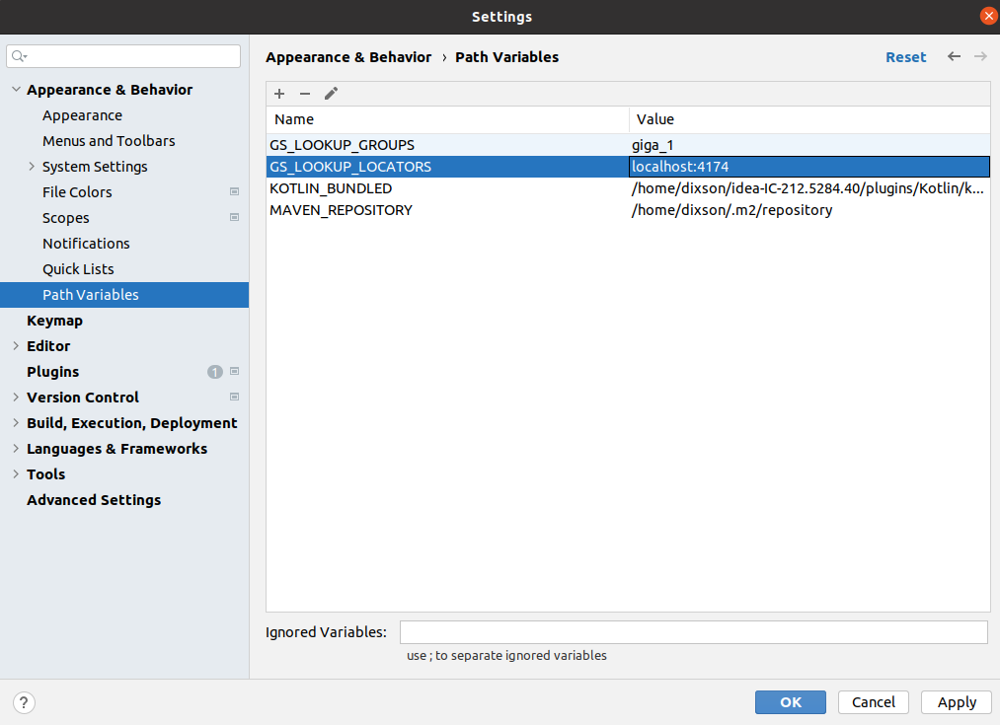

# xap-dev-training - lab5-solution

## 5.1	Deploy BillBuddy-Space using cli.

a. Find your host name by running hostname command.
b. Go to %XAP_TRAINING_HOME%/gigaspaces-xap/bin/
c. Edit setenv-overrides.sh and put your host name as a value to XAP_MANAGER_SERVERS parameter. e.g:

## Here are some environment variables which are commonly modified:
## export JAVA_HOME=...
## export XAP_LOOKUP_GROUPS=...
## export XAP_LOOKUP_LOCATORS=...
export XAP_MANAGER_SERVERS=<your host name>
## export XAP_NIC_ADDRESS=...
## export XAP_PUBLIC_HOST=...
## export XAP_CLASSPATH_EXT=...
## export EXT_JAVA_OPTIONS=...

d. Start gs-agent with one GSM, one LUS and 2 GSCs. e.g:
./xap host run-agent --manager --gsc=2
e.	Start gs-ui. e.g: ./gs-ui.sh
f. Deploy BillBuddy_Space. e.g:
    1. Clone lab5-solution repository by creating dir: %XAP_TRAINING_HOME%/labs/lab5-solution and typing: git clone https://github.com/GigaSpaces-ProfessionalServices/xap-dev-training.git
        xap-dev-training project will be created.
    2. Open xap-dev-training project with intellij
    3. Run mvn install
    4. Run mvn xap:intellij. This will add the predefined Run Configuration Application to your Intellij IDE.
    5. Open a new Terminal and go to %XAP_TRAINING_HOME%/gigaspaces-xap/bin/
    5. Deploy BillBuddy_Space by running ./xap pu deploy BillBuddy-Space %XAP_TRAINING_HOME%/labs/lab5-solution/xap-dev-training/BillBuddy_Space/target/BillBuddy_Space.jar
    6. Run BillBuddyAccountFeeder from your Intellij.

    