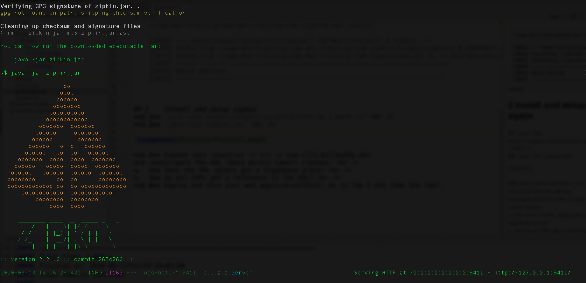
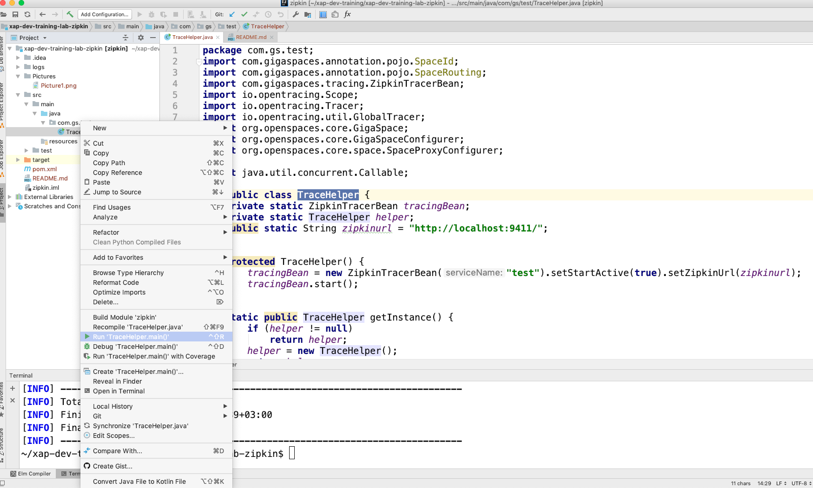
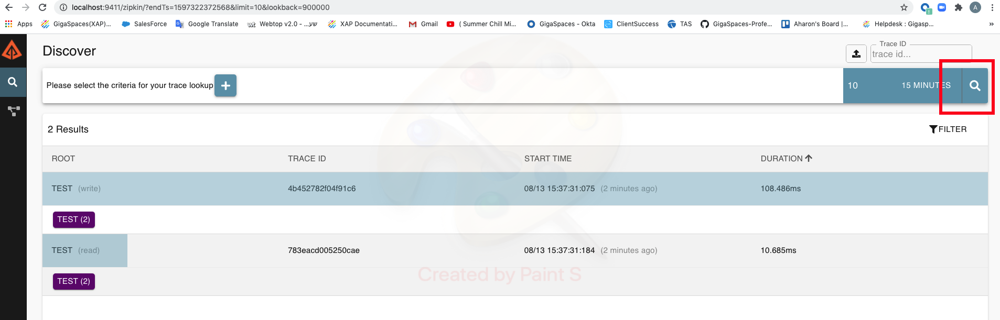

# gs-dev-training - lab18-zipkin

## 	Distributed Tracing (Zipkin)

###### Lab Goals
1.  Get familiar with Distributed Tracing (zipkin) to be able to improve performance and code efficiency.
2.  Use code with Distributed Tracing activated
3. Install and setup zipkin.

###### Lab Description
This lab includes the needed instructions and code for activate and use zipkin (Distributed Tracing)

## 1 Lab setup
Make sure you restart the service grid and gs-ui (or at least undeploy all Processing Units using gs-ui)

**1.1** Open gs-dev-training-lab-zipkin project with intellij (open pom.xml) 
**1.2** Run mvn install

    ~/gs-dev-training/lab19-zipkin$ mvn install
    
    [INFO] --- maven-install-plugin:2.4:install (default-install) @ zipkin ---
    [INFO] Installing ~/gs-dev-training/lab18-zipkin/target/zipkin-1.0-SNAPSHOT.jar to ~/.m2/repository/zipkin/zipkin/1.0-SNAPSHOT/zipkin-1.0-SNAPSHOT.jar
    [INFO] Installing ~/gs-dev-training/lab18-zipkin/pom.xml to ~/.m2/repository/zipkin/zipkin/1.0-SNAPSHOT/zipkin-1.0-SNAPSHOT.pom
    [INFO] ------------------------------------------------------------------------
    [INFO] BUILD SUCCESS
    [INFO] ----------------------------------------------------------------------

## 2	Install and setup zipkin
**2.1**	`curl -sSL https://zipkin.io/quickstart.sh | bash -s`  
**2.2**	`java -jar zipkin.jar`  

## 3 Perform GS operations when zipkin is on

**3.1**	Expand src -> main -> java -> com.gs.test
and investigate the code of the TraceHelper class  
**3.2**	Run TraceHelper main:
* Using IntelliJ:

* Using maven cli: 
`cd ~/gs-dev-training/lab18-zipkin` 
`mvn exec:java  -D"exec.mainClass"="com.gs.test.TraceHelper" -Dexec.classpathScope=compile -Dcom.gs.jini_lus.locators=localhost` 

## 4 Login to zipkin console and verify the results
**4.1**	click on http://localhost:9411 
**4.2**	Explore recent Trace IDs: 

