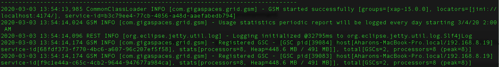
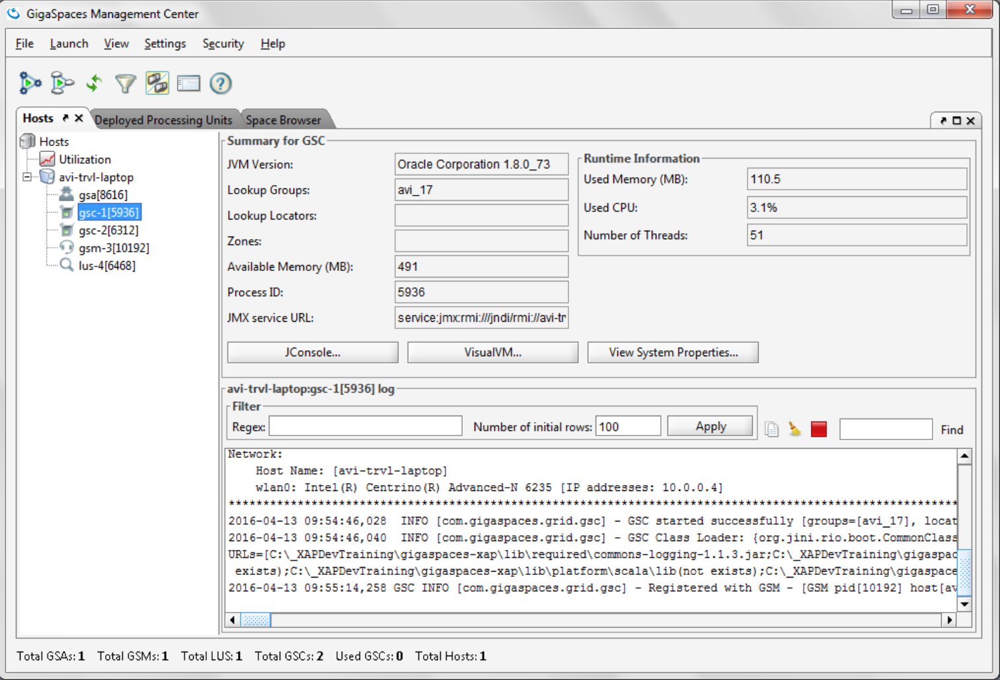
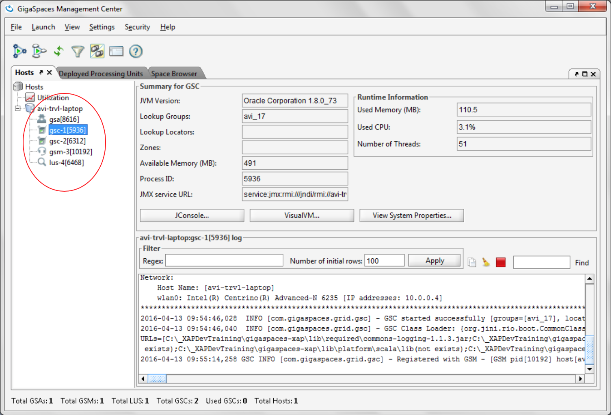
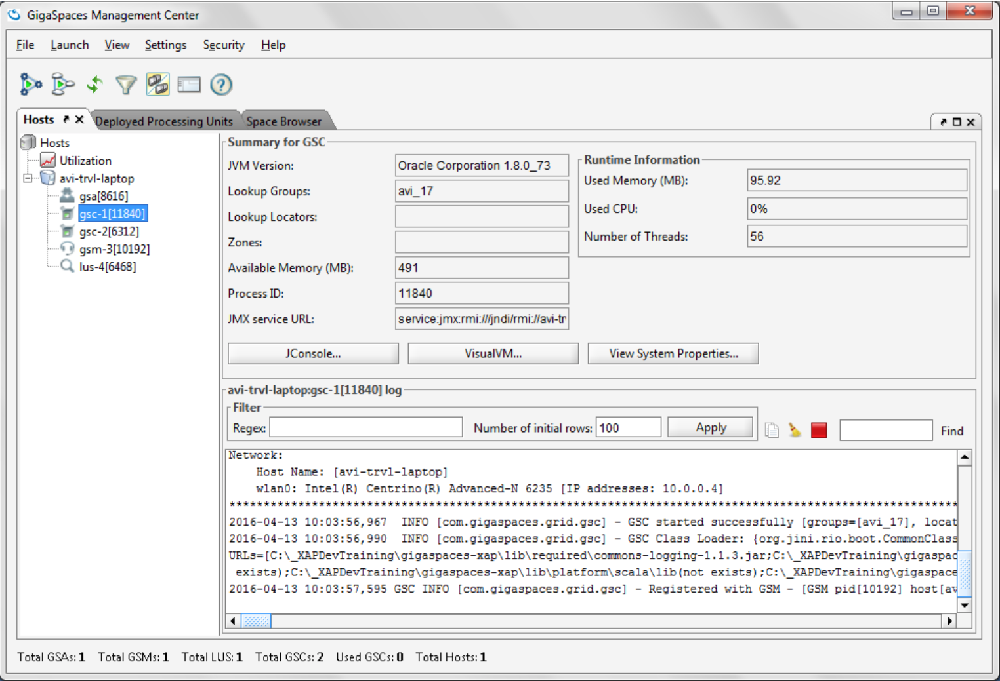
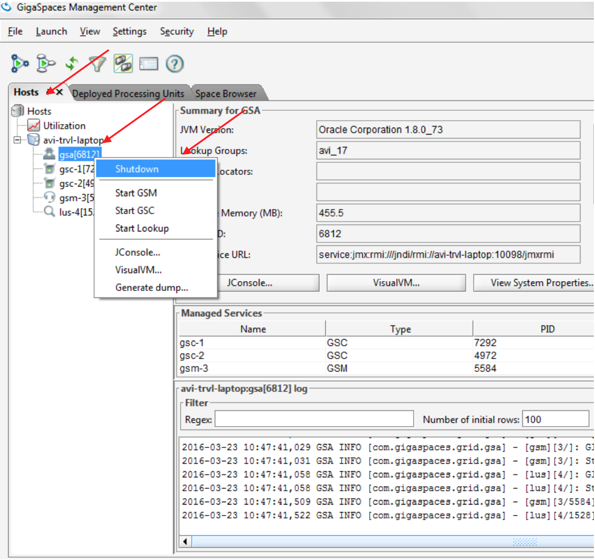

# gs-dev-training - lab02-self_healing_demo-guide

##    GSC Self Healing Demo

###### Lab Description

This lab also demonstrates self healing of a GSC.

## 1	Start Gigaspaces service grid  

    a.	Go to `$GS_HOME/bin`
    b.	./gs.sh host run-agent --auto --gsc=2
    c.	Start gs-ui
    
## 2	Examine the running environment  

    a.	Examine the ‘gigaspaces-manager.log’ Check the GSM and GSCs have started and registered successfully 

    b.	Go to the gs-ui application
    c.	Press the host tab
    d.	Press on the gsc processes to see the process information and log.

## 3	Self-Healing

In this exercise you will be introduced to the self-healing capabilities of the In Memory Data Grid.  
Basically we will ‘kill’ (using task manager or kill -9) a GSC process and see that it restarts automatically by the GSA and that new partition are created accordingly  

3.1	Kill a GSC  

Each process ID (all are JVMS) is shown at the Hosts tab (see red circle below).  
Choose 1 of the GSCs PID and use the Task Manager or in order to kill the process.  
If PID is not shown at the Task Manager simply choose “viewselect columns” and add the PID column.  
For Linux use: kill -9 <PID>

3.2	Return to the gs-ui in order to check the recovery status.

3.3	The following is the Self-Healing processes  

    a. GSC was re-launched by the GSA
    
 

3.4	Stop the runtime grid  

    a.	Press on the GSA
    b.	Right click to open GSA menu
    c.	Select shutdown
    
 

