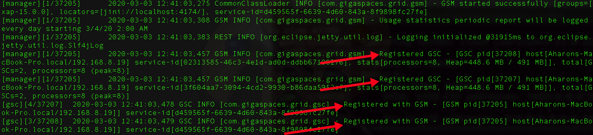
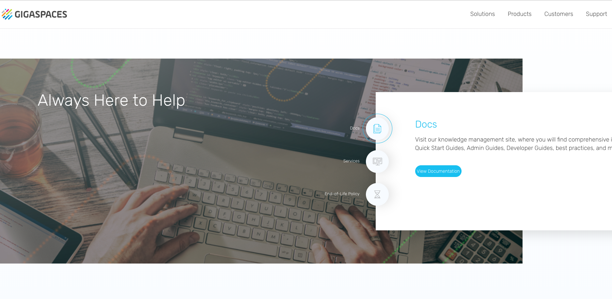
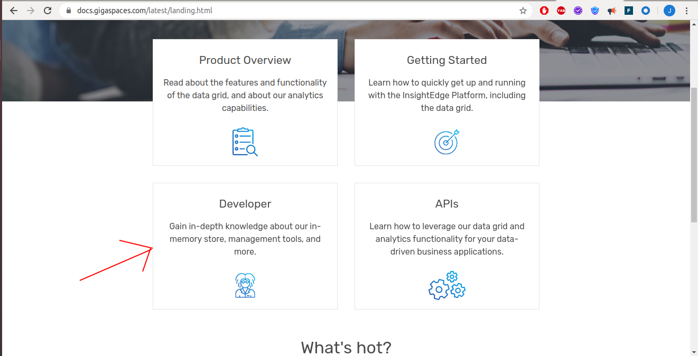

# gs-dev-training - lab00-setup-guide

##      Lab Description

A quick introduction to the setup and installation of Gigaspaces.

#### 1 Setup

##### 1.1 Download 16.2.0 GigaSpaces Enterprise Edition and extract it on your machine.
##### 1.2 Put `tryme` license to `gs-license.txt` file located at the root of Gigaspaces installation directory.
##### 1.3 Download and install IntelliJ IDEA Community:
   https://www.jetbrains.com/idea/download
##### 1.4 Go to `$GS_HOME/bin` open `setenv-overrides.sh` and set:  
   `JAVA_HOME` -> point to you java installation directory  
   `GS_LOOKUP_GROUPS` -> set any unique identifier
   
##### 1.5 Test your Gigaspaces Installation.  
   You will start a service grid and you will wait to see the processes started successfully with group [your unique group identifier]
   
   `$GS_HOME/bin/gs.sh host run-agent --auto --gsc=2`
   
   The following screen will appear:
   (Search for the message marked below):
   

   
   If you see the above, you have successfully installed the courseware for our class.
   
##### 1.5	Stop processes
    Stop the GSA process (2 options):
    1. ctrl+c
    2. ./gs.sh host kill-agent

#### 2	Wiki and API Doc Exercise  

##### 2.1 Validate internet connectivity by opening a browser and going to GigaSpaces site: 
        www.gigaspaces.com
##### 2.2 Click on support-> Documents

        

     
   
   
