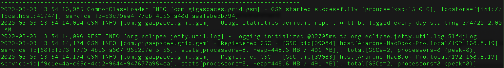
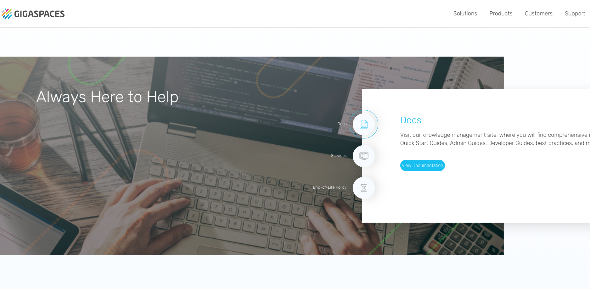

# gs-dev-training - lab01-setup-guide

## Lab Description

A quick introduction to the setup and installation of Gigaspaces.

#### 1 Setup

1. Download GigaSpaces Enterprise Edition version 16.2.0 and extract it on your machine.
2. Put `tryme` license in `gs-license.txt` file located at the root of Gigaspaces installation directory.
3. Download and install IntelliJ IDEA Community:

https://www.jetbrains.com/idea/download

4. Go to `$GS_HOME/bin` open `setenv-overrides.sh` and set:

* `JAVA_HOME` -> point to your JDK installation directory
* `GS_LOOKUP_GROUPS` -> set to any unique identifier

5. Test your Gigaspaces installation.

You will start a service grid and you will wait to see the processes started successfully with group [your unique group identifier]

`$GS_HOME/bin/gs.sh host run-agent --auto --gsc=4`

The following screen will appear:
(Search for the message marked below):

If you see the above, you have successfully installed the courseware for our class.

#### 2	Start Gigaspaces UI

1. Start gs-ui, from `$GS_HOME/bin`:

`./gs-ui.sh`
    
#### 3	Examine the running environment
    
Examine the ‘gigaspaces-manager.log’ Check the GSM and GSCs have started and registered successfully 

1.	Go to the gs-ui application
2.	Press the host tab
3.	Press on the gsc processes to see the process information and log.
    

4.	Open your browser and go to localhost:8099
5.	Examine the webui console.
6.	You will learn more about it at a later session.
    

#### 4	Stop processes
Stop the GSA process (2 options):

1. ctrl+c
2. `./gs.sh host kill-agent`

#### 5	Wiki and API Doc Exercise

##### 5.1 Validate internet connectivity by opening a browser and going to GigaSpaces site:
        www.gigaspaces.com
##### 5.2 Click on support-> Documents

