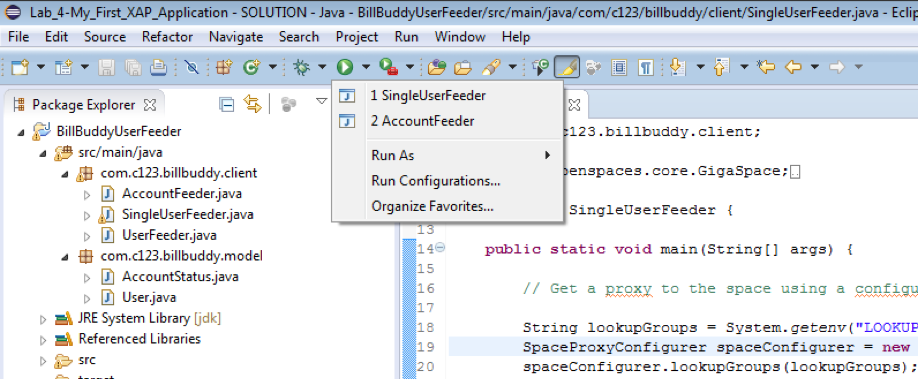
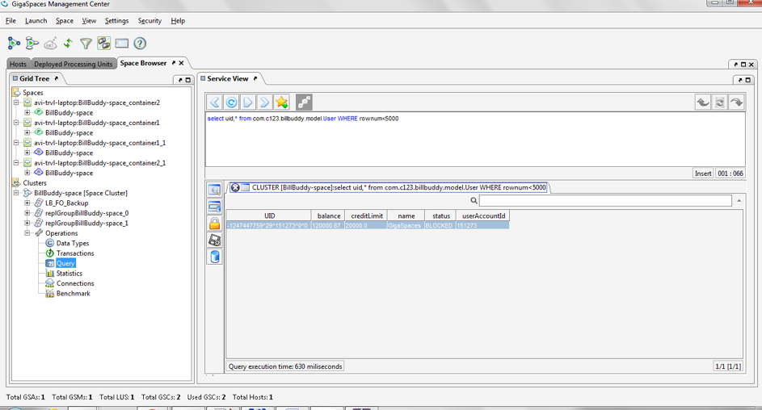

# gs-dev-training - lab05-first_gs_application-solution

##  My First Gigaspaces Application

###### Lab Goals
1.	Experience Gigaspaces client code and see how easy it is to develop a Gigaspaces simple application
2.	Deploy a space using GS CLI

###### Lab Description

This Description will let you examine simple code applications that access the space and write/read users. 
Two applications will be used, both using standard Java (no Spring).
You will first deploy a space using the GS CLI to serve as your space, 
afterwards you will run the 2 applications and examine the results.
The first application will connect and write a single users. 
The second application “AccountFeeder” will create and write multiple user POJOs
and read all of them in a single readMultiple command.
## 1 Lab setup
Make sure you restart the service grid and gs-ui (or at least undeploy all Processing Units using gs-ui)
               
1.1 Open gs-dev-training/lab05-first_gs_application-solution project with intellij (open pom.xml) 
1.2 Run mvn install

    ~/gs-dev-training/lab05-first_gs_application-solution$ mvn install
    
    [INFO] ------------------------------------------------------------------------
    [INFO] Reactor Summary:
    [INFO] 
    [INFO] lab05-solution 1.0-SNAPSHOT ......................... SUCCESS [  1.033 s]
    [INFO] BillBuddyUserFeeder 1.0-SNAPSHOT ................... SUCCESS [  7.597 s]
    [INFO] ------------------------------------------------------------------------
    [INFO] BUILD SUCCESS

1.3 Copy the runConfigurations directory to the Intellij .idea directory to enable the Java Application configurations. Restart Intellij.

###### This will add the predefined Run Configuration Application to your Intellij IDE.

## 2  Deploy BillBuddy_Space

2.1 Open a new Terminal and navigate to `$GS_HOME/bin`  

    `cd $GS_HOME/bin`
    
2.2 Raise the service grid:

    ./gs.sh host run-agent --auto --gsc=4
    
2.3 Use GS CLI to deploy BillBuddy_space

    ./gs.sh space deploy --partitions=2 --ha=true BillBuddy-space

## 3	Run User Feeder Using Configurer
3.1 Examine and run the com.gs.billbuddy.client.SingleUserFeeder file.   
a.	Locate the code fragment in which you get a proxy to the space.   
b.	Edit the SingleUserFeedercreatenewSpaceProxyConfigurer to connect to remote space – BillBuddy-space.   
###### HINT: look for the TODO& follow the instructions  
c.	Examine the code that writes a User to the space  
d.	Examine the code that reads a User from the space  
e.	Execute the project in Intellij to run user into the space

###### Note: the pictures are Eclipse snapshots but refers to Intellij as well.

## 4	Run User Feeder
###### Examine and run the com.gs.billbuddy.client.AccountFeeder.  
4.1 Check the UserFeeder.loadData() method.  
4.2 Open run configuration options in Intellij.  
4.3 Execute the AccountFeeder
