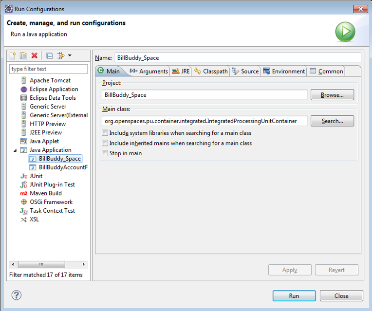
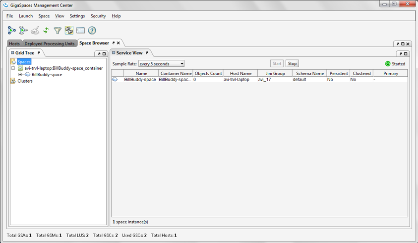
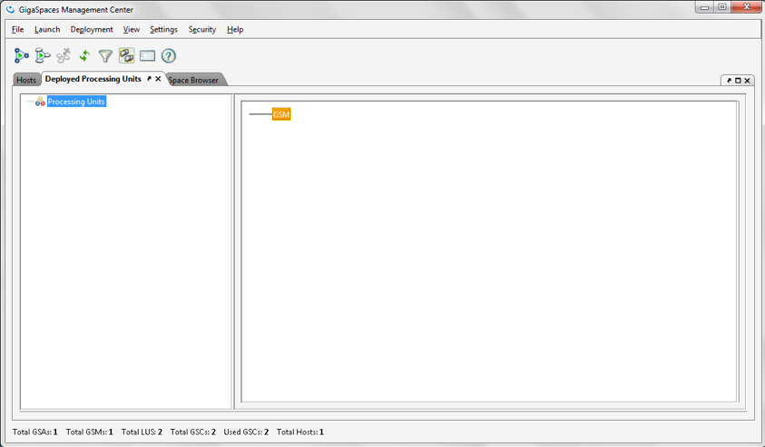
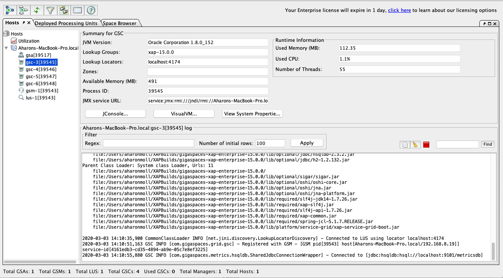
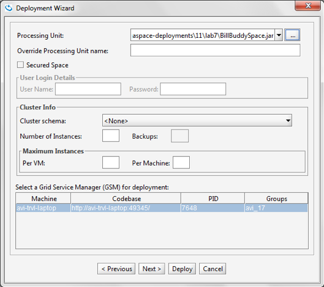

# gs-dev-training - lab06-processing_unit_intro-exercise

## Processing Unit

###### Lab Goals
1. Configure your processing unit for space deployment.
2. Deploy a space in several different methods. 

###### Lab Description
This lab includes two exercises:
1. 	Configure your processing unit space definitions & deployment rules
2. 	Space Deployment Methods. You will deploy a space Processing Unit via 2 different methods.

## 1 Lab setup
Make sure you restart the service grid and gs-ui (or at least undeploy all Processing Units using gs-ui)
               
1.1 Open gs-dev-training/lab06-processing_unit_intro-exercise project with intellij (open pom.xml)  
1.2 Run mvn package

    ~/gs-dev-training/lab06-processing_unit_intro-exercise$ mvn package
    
    [INFO] ------------------------------------------------------------------------
    [INFO] Reactor Summary:
    [INFO] 
    [INFO] lab06-exercise 1.0-SNAPSHOT ......................... SUCCESS [  1.547 s]
    [INFO] BillBuddyModel ..................................... SUCCESS [  7.115 s]
    [INFO] BillBuddy_Space .................................... SUCCESS [  0.893 s]
    [INFO] BillBuddyAccountFeeder 1.0-SNAPSHOT ................ SUCCESS [  1.604 s]
    [INFO] ------------------------------------------------------------------------
    [INFO] BUILD SUCCESS

1.3 Copy the runConfigurations directory to the Intellij .idea directory to enable the Java Application configurations. Restart Intellij.
###### This will add the predefined Run Configuration Application to your Intellij IDE.

## 2	Space Topologies
**2.1** Configure space in the pu.xml files in BillBuddy_Space project  
a. Define embedded space.  
b. Define GigaSpace.  

**2.2**	Configure Partitioned Space (2 partitions) in the sla.xml file as 1 backup per each partition in the BillBuddy_Space project. 

## 3  Deploy a PU with Embedded Space – Integrated Processing Unit Container
**3.1**   The Integrated Processing Unit Container is the preferred way to 
deploy Processing Unit during development.  
**a.** Stop the service grid (you are not deploying to the grid in this lab) if one is running.   
This is not a must but it will emphasize the fact 
that you are running your PU without the need of the GRID.  
**b.**	Re-open gs-ui (close if it is running and start again). 
Make sure no Space is deployed (you might need to Un-deploy your previously deployed space from prior labs)  
**c.**	Go to Intellij “run configurations” and choose the BillBuddy_Space. As you can see the main class used is the org.openspaces.pu.container.integrated.IntegratedProcessingUnitContainer class.

###### Note: the pictures are Eclipse snapshots but refers to Intellij as well.

**d.**	Press run.  
**e.**	Where do you see the space in gs-ui?   
    Can you guess why you can see it only there?   
**f.**	Check if your space is deployed in the “space browser” tab.   
    You can only see the space in the space browser since you did not deploy your PU to the Grid <vr />
    but used integrated processing unit container, so, no GSCs are deployed with your PU.   
    The integrated processing unit container does not use the sla.xml configuration.  
    It just deploys a simple single space instance.
    

**g.**	Check the “Deployed Processing Unit” tab to see that the Grid does not know about your space.

**3.2**   Run the BillBuddyAccountFeeder (main class UserFeederActivator) application 
        and check Users are written to the space. 
        
## 4	Deploy a PU with Embedded Space to the Grid
**4.1** Run mvn package  
**4.2**	Deploy the space to the grid service.  
**a.**  Start the service grid and gs-ui (if they are not already running).  
**4.3**	Make sure no Space is deployed (you might need to Un-deploy your pre-deployed space from prior labs).

**4.4**	Deploy the space using gs-ui.  
**a.**	Choose “Deploy Application” option:

**b.**	Choose “Deploy Application” option.  
**c.**  Browse to gs-dev-training/lab06-processing_unit_intro-exercise/BillBuddy_Space/target/BillBuddy_Space.jar  
    and press deploy

**d.**	Wait until deployment completes.  
**e.**	Run the BillBuddyAccountFeeder application and check Users are written to the space.
