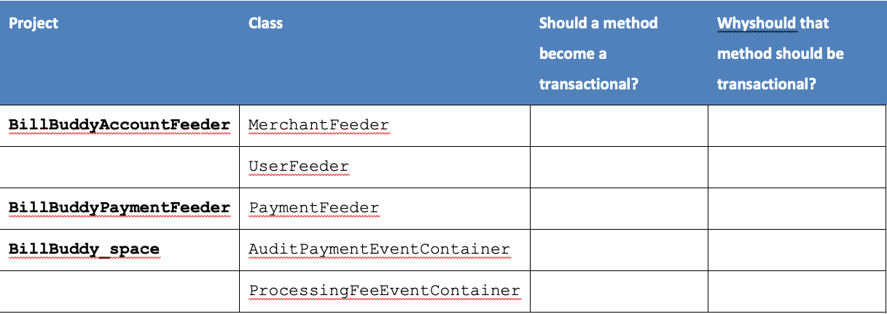
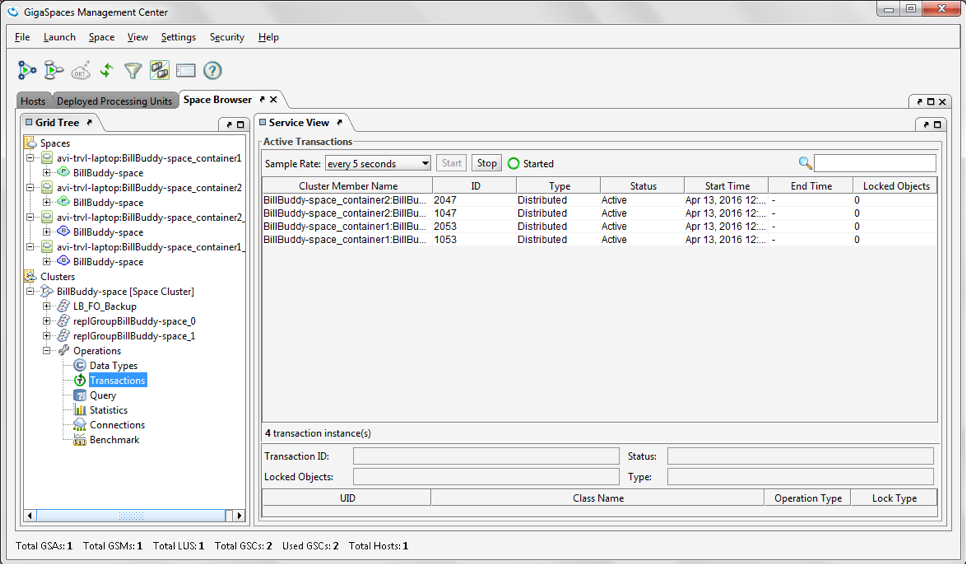

# gs-dev-training - lab13-transactions-exercise

## 	Transactions

###### Lab Goals
1.  Enable Transaction processing 
2.  Practice the concept transactional operations
3.  Implement the necessary modification to make required operations transactional
4.  Learn how to monitor transactions using gs-ui

###### Lab Description
This lab includes 4 exercises:
1. 	Transactional operations design. 
2.	Implement transaction operations at the client layer.
3. 	Implement transaction operations at the space layer.
4. 	Monitor transactions using gs-ui.

## 1 Lab setup
Make sure you restart the service grid and gs-ui (or at least undeploy all Processing Units using gs-ui)

1.1 Open gs-dev-training/lab13-transactions-exercise project with intellij (open pom.xml)  
1.2 Run mvn install

    ~/gs-dev-training/lab13-transactions-exercise$ mvn install
    
       [INFO] ------------------------------------------------------------------------
       [INFO] Reactor Summary:
       [INFO] 
       [INFO] lab13-exercise 1.0-SNAPSHOT ........................ SUCCESS [  0.863 s]
       [INFO] BillBuddyModel ..................................... SUCCESS [  5.850 s]
       [INFO] BillBuddy_Space .................................... SUCCESS [  0.532 s]
       [INFO] BillBuddyAccountFeeder ............................. SUCCESS [  0.818 s]
       [INFO] BillBuddyPaymentFeeder 1.0-SNAPSHOT ................ SUCCESS [  0.598 s]
       [INFO] ------------------------------------------------------------------------
       [INFO] BUILD SUCCESS

1.3 Copy the runConfigurations directory to the Intellij .idea directory to enable the Java Application configurations. Restart Intellij.
###### This will add the predefined Run Configuration Application to your Intellij IDE.

## 2	Transactional operations design
Review the following classes and determine if the application 
will benefit from enabling transaction for each of them. 
Explain why you think transactions would be helpful. 
Remember that transactions add performance overhead.  

## 3	Implement transaction operations at the client and Space
In this exercise we will enable transactional support and 
make the following feeders Transactional. Not much coding is required.   
3.1	Enable transactional support for BillBuddy_space(Hint: edit pu.xml)  
3.2	Implement transaction support for the ProcessingFeePollingEventContainer
        Make sure you annotate the ProcessingFeePollingEventContainer class. 

Search for comments  
3.3	Make PaymentFeeder transactional.  
a.	Enable transactional support for PaymentFeeder  
1.	Add Support for Spring Annotations  (pu.xml)
2.	Add a transaction manager to your space (pu.xml)  

b.	Make sure every single payment being created and initially 
    processed is done under a transaction.  
Search for //TO DO comments.  
Hints:
Not much editing is required. Find the method you need to annotate. 

3.4	Please specify what is needed in order to implement 
        transaction support for the MerchantFeeder.
        You are not required to do coding in this lab, 
        just specify how you should modify your code.
        Present your proposed modification to the trainer.

## 4	Monitor transactions using gs-ui
4.1	Deploy your space to the grid service. 
4.2	Run the AccountFeeder. 
4.3	Run the PaymentFeeder. 
4.4	Go to gs-ui and watch ACTIVE transactions using the transaction operation.

