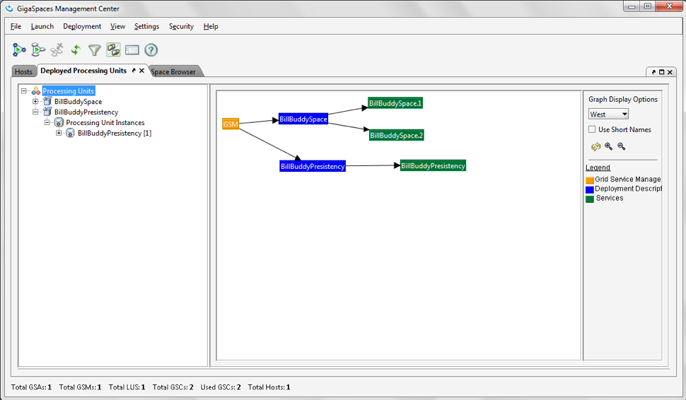

# gs-dev-training - lab16-persistency-exercise

## Persistency – Mirror Service

###### Lab Goals

1. Understand the tasks involved in implementing a mirror service.
2. Implement a mirror service.

###### Lab Description

This lab includes 1 exercise in which we will perform the tasks required to implement a mirror service.  
Use the slides from the lesson as a reference.

## 1 Lab setup

Make sure you restart the service grid and gs-ui (*or at least undeploy all Processing Units using gs-ui*)

1. Open gs-dev-training/lab16-persistency-exercise project with Intellij (*open the pom.xml file*)
2. Run `mvn package`
```
    ~/gs-dev-training/lab16-persistency-exercise$ mvn package  
  
    [INFO] ------------------------------------------------------------------------  
    [INFO] Reactor Summary:  
    [INFO]  
    [INFO] lab16-exercise 1.0-SNAPSHOT ........................ SUCCESS [  0.994 s]  
    [INFO] BillBuddyModel ..................................... SUCCESS [  5.310 s]  
    [INFO] BillBuddy_Space .................................... SUCCESS [  1.187 s]  
    [INFO] BillBuddyAccountFeeder ............................. SUCCESS [  1.401 s]  
    [INFO] BillBuddyPaymentFeeder 1.0-SNAPSHOT ................ SUCCESS [  1.293 s]  
    [INFO] ------------------------------------------------------------------------  
    [INFO] BUILD SUCCESS  
```

3. Copy the runConfigurations directory to the .idea project directory.

    *This will add the predefined applications to your Intellij IDE. The runConfigurations will be used in a later step to run components from the IDE.*

    1. Restart Intellij

## 2 Persistency – Mirror Service Implementation

#### 2.1 Install MySQL DB (Windows) for this lesson.

**SKIP this step if you are using Linux/Mac**

1. Go to https://dev.mysql.com/downloads/mysql and download available GA MySQL Community Server  
2. Extract it to: `C:\mysql`  
3. Note: *Make sure you shut down any prior existing mysqls in your system.*  
4. Open a command window, navigate to `C:\mysql\bin`  
    `cd C:\mysql\mysql-5.5.48-winx64\bin`   
5. Run the mysql server:  
    `mysqld --console`
    
#### 2.2 Install MySQL DB (Linux) for this lesson.

**SKIP this step if you are using Windows/Mac**  
1. Install:  
   Run: `sudo yum install mysql-server` (Red Hat) or `sudo apt-get install mysql-server` (Ubuntu)
2. Start MySQL service:  
    `/sbin/service mysqld start ( or sudo service mysqld start)`

#### 2.3 Setup MySQL DB (Mac) for this lesson.

**SKIP this step if you are using Windows/Linux**  
1. Download and install MySql server ( download DMG file link: http://dev.mysql.com/downloads/file/?id=462024 )
2. Install MySQL  
    Download and open the MySQL package installer, which is provided on a disk image (.dmg) that includes the main MySQL installation package file.  
    Double-click the disk image to open it. <br />
3. Start MySQL service
    1. Open terminal
    2. Run: `sudo /usr/local/mysql/support-files/mysql.server start`  
        Note: *If you wish to stop or restart run the same command with stop or restart at the end.*

#### 2.4 Database configuration and setup

1. Run the secure installation (below command gives option set to root password)
```
    mysql_secure_installation
    # Suggested password 'Giga1234$'
    # Mac and Linux users don't forget to use sudo
```
2. Create database and user
    1. Create the database. In a terminal window,  
        mysqladmin --user=root create jbillbuddy (located in /usr/bin)
    2. Create user and privileges
```
       mysql -u root -p
       # Mac and Linux users, don't forget to use sudo
       # In mysql session
       CREATE USER 'jbillbuddy'@'%' IDENTIFIED BY 'Giga1234$';
       GRANT ALL PRIVILEGES ON jbillbuddy.* TO 'jbillbuddy'@'%';

       # Verify
       SELECT user,host FROM mysql.user; SHOW GRANTS for jbillbuddy;
       exit

       # Optionally, check if you can login with the new user
       mysql -u jbillbuddy -p
```
3. Validate that your instance has been created:
    1.  Open terminal
    2.  Run: mysql jbillbuddy -u root -p
    3.  Run: show tables;
    4.  Verify no tables exist.

#### 2.5 Configure your space to be mirror service aware.

1. Modify your embedded Space pu.xml. `mirrored="true"` space element tag (Hint: Refer to BillBuddy_space pu.xml)

#### 2.6 Map the data model to tables (using Hibernate annotations.)

1. Search the data model to see which POJOs were chosen for persistency for our demo.
2. Examine specifically the User and Address relationship and try to figure out the meaning of the Hibernate annotations.

#### 2.7 Configure the mirror service.

The mirror service requires having to be configured appropriately.  
The lab is already configured correctly for you.  
Your task is to locate the file in which the configuration is defined.  
Basically you should be able to answer the following questions prior to configuring the environment.  

1. What space am I Mirroring?  
    Answer: BillBuddy-space
2. Which POJOs am I to persist?  
   Answer: In this lab we will persist: User, Merchant, Payment, ProcessingFee and Contract  
   Package Name: `com.gs.billbuddy.model`
3. What is the database (in most cases) that I am persisting to?  
   Answer: we will use MySQL DB for demo purposes.
4. What are the DB user name, DB password, JDBC URL and JDBC Driver?  
   Answer:


#### 2.8 The following tasks will make it clearer how to implement a Mirror service.

Hint: *Use slides from the lesson as a reference. Most tasks are already implemented.*

1. Expand BillBuddyPersistency and open the pu.xml file.
2. Locate the data source bean (DB Connection properties).
    Write down the user and the password for the MySQL DB database  
    (You will use it later).
3. Specify Space Components to be mapped using package scanning.

Configure Spring to locate your Hibernate annotated classes.
1. Fill in the package to be scanned where your persistent POJOs are located.  
    (Search the POJOs in the model that were annotated with `@Entity` and write their full name in the SessionFactory bean).  
    `<property name="packagesToScan" value="com.gs.billbuddy.model" />`  
    Hint: *There are 4 classes only for this demo (but all in the same package)*
2. Specify the mirror to recognize the mirror space (*This step is already implemented*).
4. Complete the `os-core:mirror` and `os-core:source-space` namespace tags.  
    Use slides from the lesson as a reference.

#### 2.9 Make sure you have a database ready for use.
We will using MySQL db instance.

1. Make sure you have the MySQL instance up and running (*Refer to the sections above*)

#### 2.10 Jar the BillBuddyPersistency project. Make sure to include the BillBuddyModel in the jar file.

#### 2.11 Deploy and test the Mirror service (and your space). <br />

1. Start the service grid
    `./gs.sh host run-agent --auto --gsc=5`
2. Run gs-ui
3. Deploy BillBuddy_space to the service grid.  
    `./gs.sh pu deploy BillBuddy-Space ~/gs-dev-training/lab16-persistency-exercise/BillBuddy_Space/target/BillBuddy_Space.jar`
4. Deploy BillBuddyPersistency to the service grid (*Remember to include BillBuddy model Project. See below*)  
    `./gs.sh pu deploy BillBuddyPersistency ~/gs-dev-training/lab16-persistency-exercise/BillBuddyPersistency/target/BillBuddyPersistency.jar`
5. Validate Mirror service deployed by using gs-ui



6. Locate the GSC your mirror service was deployed to using gs-ui and see the GSC log to validate successful deployment.  
    Search for the following message in both GSCs that contain primary space instances:  
    `2014-02-07 14:16:14,884 BillBuddy_space.2 [1] INFO [com.gigaspaces.replication.channel.BillBuddy-space2.primary-backup-reliable-async-mirror-2.mirror-service] - Outgoing Replication Channel: moved to state: CONNECTED`


7. Run BillBuddyAccountFeeder
8. Run BillBuddyPaymentFeeder

#### 2.12 Validate Data in MySQL

1. Open a terminal window
2. Navigate to the MySQL bin directory
3. Run the following command in order to connect to the BillBuddy database:  
    `mysql -u jbillbuddy -p jbillbuddy`  
    When prompted for a password, enter a password Giga1234$
4. Use the command in order to view your table list. These tables were created by Hibernate mappings.
    `show tables;`
5. Select the content of any table by issuing the following command:
    `select * from Merchant;`
6. Validate the results


#### 2.14 Monitoring the Mirror service


#### 2.15 Compare the number of mirror total operations against the overall number of POJOs you have.
Count only POJOs you persist. Can you explain why there are many more mirror operations than POJOs?


