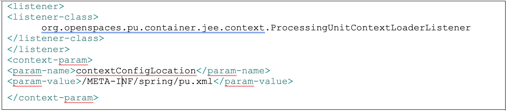

# gs-dev-training - lab17-web_app-exercise

## 	Web Applications

###### Lab Goals
1.  Implement the required configuration in order to make a web application become a processing unit web application. 
2.  Deploy the web application to the service grid
###### Lab Description
This lab includes one exercise in which you will fix a web application in order for it to connect to the BillBuddy_space and access the space.
## 1 Lab setup
Make sure you restart the service grid and gs-ui (or at least undeploy all Processing Units using gs-ui)

**1.1** Open gs-dev-training/lab17-web_app-exercise project with intellij (open pom.xml) 
**1.2** Run mvn install

    ~/gs-dev-training/lab17-web_app-exercise$ mvn install
    
    [INFO] ------------------------------------------------------------------------
    [INFO] Reactor Summary:
    [INFO] 
    [INFO] lab17-exercise 1.0-SNAPSHOT ........................ SUCCESS [  1.281 s]
    [INFO] BillBuddyModel ..................................... SUCCESS [  8.079 s]
    [INFO] BillBuddy_Space .................................... SUCCESS [  1.176 s]
    [INFO] BillBuddyAccountFeeder ............................. SUCCESS [  0.859 s]
    [INFO] BillBuddyPaymentFeeder 1.0-SNAPSHOT ................ SUCCESS [  0.697 s]
    [INFO] ------------------------------------------------------------------------
    [INFO] BUILD SUCCESS

**1.3** Copy the runConfigurations directory to the Intellij .idea directory to enable the Java Application configurations. Restart Intellij.
###### This will add the predefined Run Configuration Application to your Intellij IDE.

## 2	Fix and deploy a Web Applications
**2.1**	Expand the BillBuddyWebApplication project.  
**2.2**	Locate the pu.xml file.  
Examine the pu.xml file. Identify the location of the gigaSpace bean. 
Is it configured differently in this project than any other feeder project?   
**2.3**	Locate the web.xml file.  
**2.4**	Fix the web.xml file by adding the following to the listener:

]

**2.5**	Expand Java resources -> src -> com.gs.billbuddy.dal 
and investigate the DAL (Data Access Layer) classes.  
a.	How does the DAL object get a GigaSpace proxy?  
b.	How do all JSPs get a reference to the DAL?  
**2.6**	Deploy and test your web application(Hint: Go to lab 5 and redo the lab).
