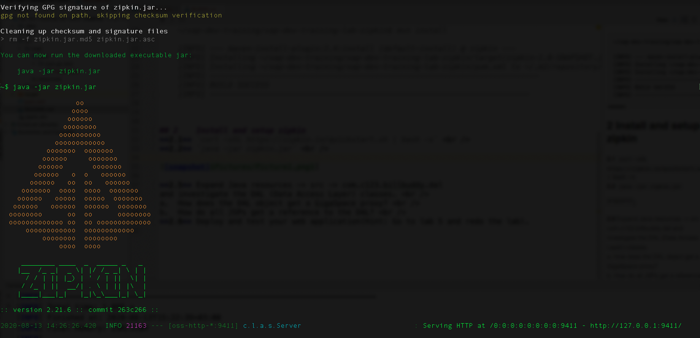

# gs-dev-training - lab18-zipkin-guide

## Distributed Tracing (Zipkin)

###### Lab Goals
1. Get familiar with Distributed Tracing (Zipkin). Zipkin can be used to improve performance and code efficiency.
2. Install and setup zipkin.
3. Use code with Distributed Tracing activated.

###### Lab Description
This lab includes the needed instructions and code to activate and use Zipkin.

## 1 Lab setup
Make sure you restart the service grid and gs-ui (or at least undeploy all Processing Units using gs-ui)

1. Deploy a space called demo. Use any of the ui tools or `$GS-HOME/bin/gs.sh space deploy demo`
2. Open gs-dev-training/lab18-zipkin-guide project with Intellij (open pom.xml)
3. Run `mvn compile`

## 2 Install and setup Zipkin
1. `curl -sSL https://zipkin.io/quickstart.sh | bash -s` 
2. `java -jar zipkin.jar`

## 3 Perform GS operations when Zipkin is enabled 

1. Expand src -> main -> java -> com.gs.test and investigate the code of the TraceHelper class

2. Run TraceHelper main:
* Using IntelliJ:

* Using maven cli:

`cd ~/gs-dev-training/lab18-zipkin-guide`

`mvn exec:java  -D"exec.mainClass"="com.gs.test.TraceHelper" -Dexec.classpathScope=compile -Dcom.gs.jini_lus.locators=localhost`

## 4 Login to Zipkin console and verify the results
1. Click on http://localhost:9411

2. Explore recent Trace IDs:

