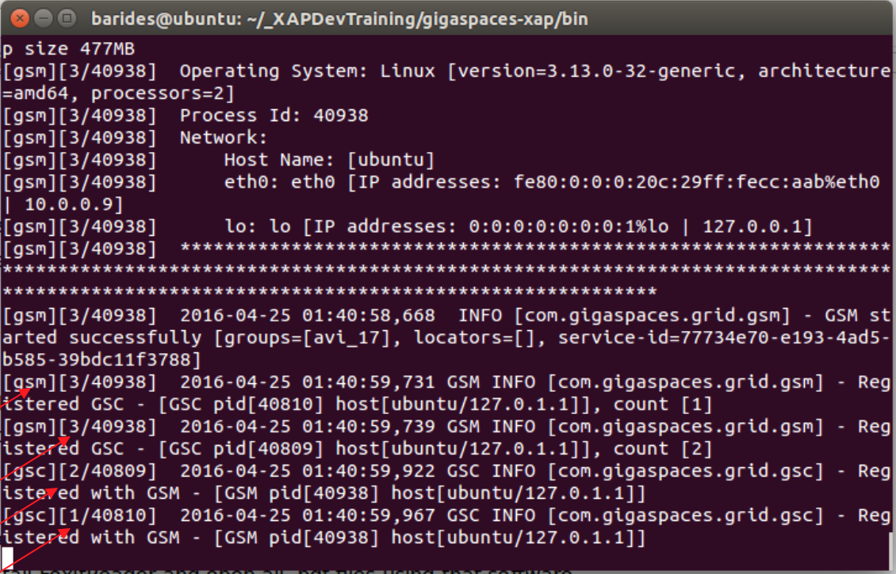
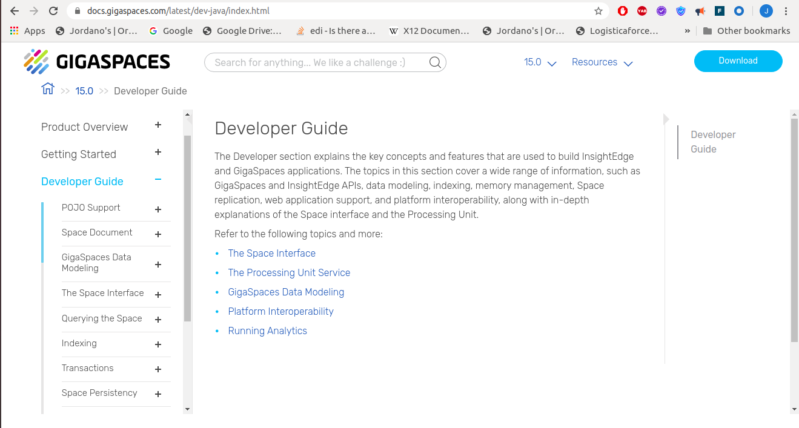

# xap-dev-training - lab1-guide

## 	Introduction

#### 1 setup

##### 1.1 Download 15.0.0 XAP Commercial Edition and extract it on you machine.
##### 1.2 Put `tryme` license to `xap-license.txt` file located at the root of xap installation directory.
##### 1.3 Download IntelliJ IDEA Community:
   https://www.jetbrains.com/idea/download
##### 1.4 Go to `$XAP_HOME/bin` open `setenv-overrides.sh` and set:  
   `JAVA_HOME` -> point to you java installation directory  
   `GS_LOOKUP_GROUPS` -> set any unique identifier
   
##### 1.5 Test your XAP Installation.  
   You will start a XAP process (gs-agent) and you will wait to see a message that the gs-agent started successfully with groups [<your user group>]
   
   cd ${XAP_TRAINING_HOME}/gigaspaces-xap/bin 
   ./gs.sh host run-agent --auto --gsc=2
   
   The following screen will appear:
   (Search for the message marked below):
   

   
   If you see the above, you have successfully installed the courseware for our class.
   
##### 1.5	Stop processes
    Stop the gs-agent process (2 options):
    1. ctrl+c
    2. ./gs.sh host kill-agent

#### 2	Wiki and API Doc Exercise  

##### 2.1 Validate internet connectivity by opening a browser and going to GigaSpaces site: 
        www.gigaspaces.com
##### 2.2 Click on support-> Documents

        

     
   
   
