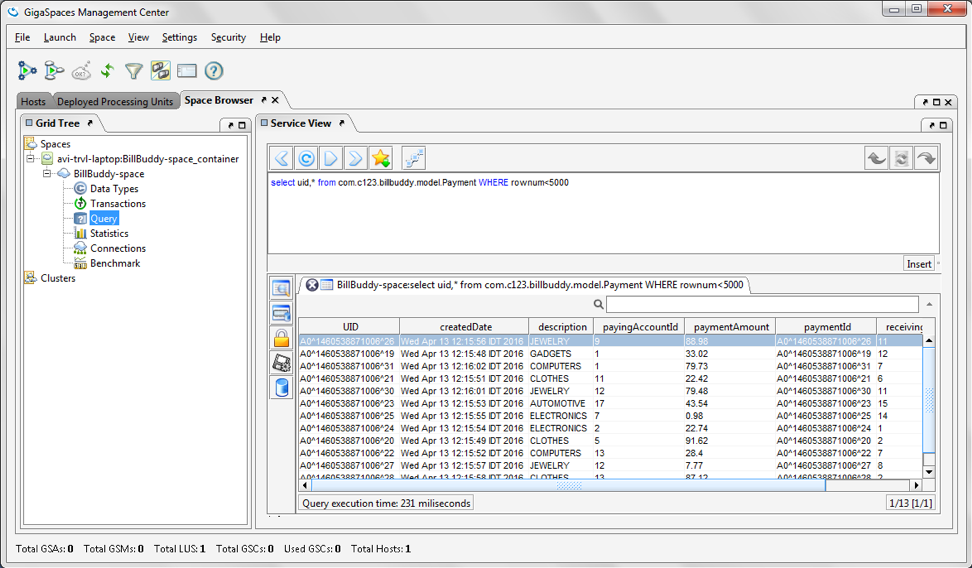
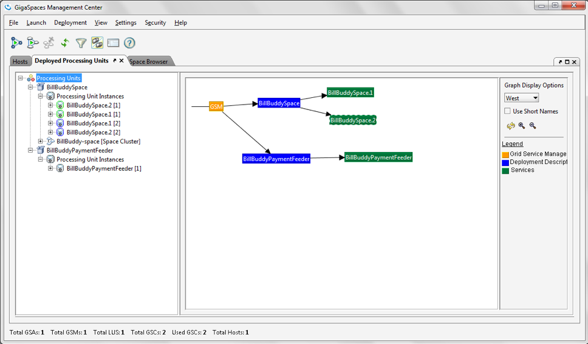
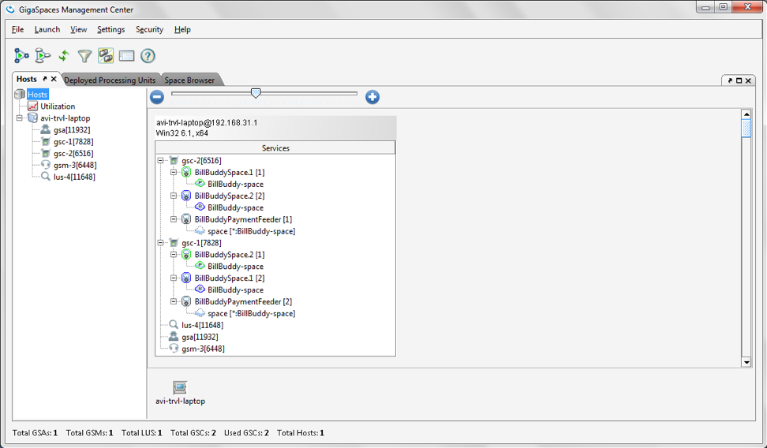

# xap-dev-training - lab10-solution

## 10 Space Access API

###### Lab Goals
Implement Processing Unit client feeder that requires a wider space data access operations.
###### Lab Description
This lab includes3 solutions:
1.	WIKI Search for the “GigaSpace Interface”. 
    You will practice using the Wiki for getting useful information that might be needed for this lab. 
2.	Space Data Access API: Develop the PaymentFeeder processing unit
3.	Only if time permits: SQL Query operation: You will practice writing a SQL query
## 1 Lab setup
Make sure you restart the service grid and gs-ui (or at least undeploy all Processing Units using gs-ui)

1.1 Open %XAP_TRAINING_HOME%/xap-dev-training-lab10-solution project with intellij (open pom.xml)  
1.2 Run mvn install

    ~/xap-dev-training/xap-dev-training-lab10-solution$ mvn install
    
      [INFO] Reactor Summary:
      [INFO] 
      [INFO] Lab10-solution 1.0-SNAPSHOT ........................ SUCCESS [  1.276 s]
      [INFO] BillBuddyModel ..................................... SUCCESS [  4.326 s]
      [INFO] BillBuddy_Space .................................... SUCCESS [  0.603 s]
      [INFO] BillBuddyAccountFeeder ............................. SUCCESS [  1.489 s]
      [INFO] BillBuddyPaymentFeeder ............................. SUCCESS [  1.244 s]
      [INFO] BillBuddy_Space 1.0-SNAPSHOT ....................... SUCCESS [  1.072 s]
      [INFO] ------------------------------------------------------------------------
      [INFO] BUILD SUCCESS

1.3 Run mvn xap:intellij
###### This will add the predefined Run Configuration Application to your Intellij IDE.

    ~/xap-dev-training/xap-dev-training-lab10-solution$ mvn xap:intellij
    
     [INFO] --- xap-maven-plugin:14.0.1:intellij (default-cli) @ Lab10-solution ---
     [INFO] ------------------------------------------------------------------------
     [INFO] Reactor Summary:
     [INFO] 
     [INFO] Lab10-solution 1.0-SNAPSHOT ........................ SUCCESS [  0.694 s]
     [INFO] BillBuddyModel ..................................... SKIPPED
     [INFO] BillBuddy_Space .................................... SKIPPED
     [INFO] BillBuddyAccountFeeder ............................. SKIPPED
     [INFO] BillBuddyPaymentFeeder ............................. SKIPPED
     [INFO] BillBuddy_Space 1.0-SNAPSHOT ....................... SKIPPED
     [INFO] ------------------------------------------------------------------------
     [INFO] BUILD SUCCESS

## 2	Docs Search for GigaSpace Interface	
Open a browser and go to: http://docs.gigaspaces.com/  
Search the docs for “API Documentation”.  
Search the Javadoc GigaSpace API for the GigaSpace Interface.   
Investigate the different methods and their signatures. 

## 3	Space Data Access API	
3.1	In this exercise you will implement the Payment Feeder class.  
3.2	Open the BillBuddyPaymentFeeder project.  
        Payment Feeder creates a random payment every 1 second.  
        The exercise focuses on space data access API;   
        the other Java code is already prepared for you.   
        The overall process of creating a payment is:
1.	Read an existing User randomly for auditing purposes.   
2.	Read an existing Merchant randomly for auditing purposes.  
3.	Determine payment amount randomly.  
4.	Check if User has enough money in its balance.  
5.	If User does not have enough balance, 
    deposit a random amount of money to the user account so the simulation feeder may continue.  
6.	If the User does have enough balance you will create a payment.   
a.	Create a Payment instance and set its properties accordingly.   
b.	Update the User balance in the space (withdraw the amount from the balance).  
c.	Update the Merchant balance in the space (deposit the amount to the receipts property).  
d.	Write the Payment object to the space.  

Follow the //TODO: comments top down and implement the missing code.  
Hints:
1.	You might want to use gigaSpace.count(Template) in order to find out how many users and merchants you have prior to choosing them randomly. 
2.	Remember that the UserFeeder and MerchantFeeder are generating UIDs starting 1 for both Merchants and Users. 
3.	RunBillBuddy_Space to deploy the space to the Integrated Processing Unit Container using Intellij run configuration.
4.	RunBillBuddyAccountFeeder and BillBuddyPaymentFeeder using Intellij run configuration.

3.3	Validate that Payment Object are written to the space using gs-ui.
 

3.4	Deploy PaymentFeeder and BillBuddySpace to the service grid.

*	Deploy PaymentFeeder to the service grid using gs-ui by following the steps below.   
    (This means you have to jar your PaymentFeeder project together with the BillBuddyModel project 
    like you did for the BillBuddySpace).  
    Follow these steps:  
        *   Stop all Integrated PU Container in your IDE. 
        *   Restart the service grid. 
        *   Restart gs-ui. 
        *   Deploy BillBuddy-space to the service grid (if not already deployed). 
        *   Run AccountFeeder from your IDE. 
        *   Deploy PaymentFeeder jar to the service grid. 
        *   Check payments are created. 
        *   Press on the Deployed Processing Units tab. 
 
 

*   After successful deployment and validation you might want to scale up your feeding load on the system:
 

*   Press on the BillBuddyPaymentFeederProcessingUnitInstances and then press on the add instances.   
    When doing that a new PU instance will be deployed and started. 
*   Check how many payments are created per second. 
    It should be about 2 per second (Or about the number of PaymentFeeder PU instance per second).  
*   Check where your PaymentFeeder PU instance was deployed.

## 4	SQL Query(Only if time permits)
4.1	Open project merchantsOfTop5Payments.  
4.2	Write query (SQLQuery object) to retrieve top five payments exists in the space.  
4.3	For each payment, print the details of the merchant receiving the payment.  
4.4	Run BillBuddy-space (use theIntegrated PU Container containers).  
4.5	Run BillBuddyAccountFeeder.  
4.6	Run BillBuddyPaymentFeeder for 30 seconds.  
4.7	Run your new MerchantOfTop5Payments client.  
4.8	examine your results.  
