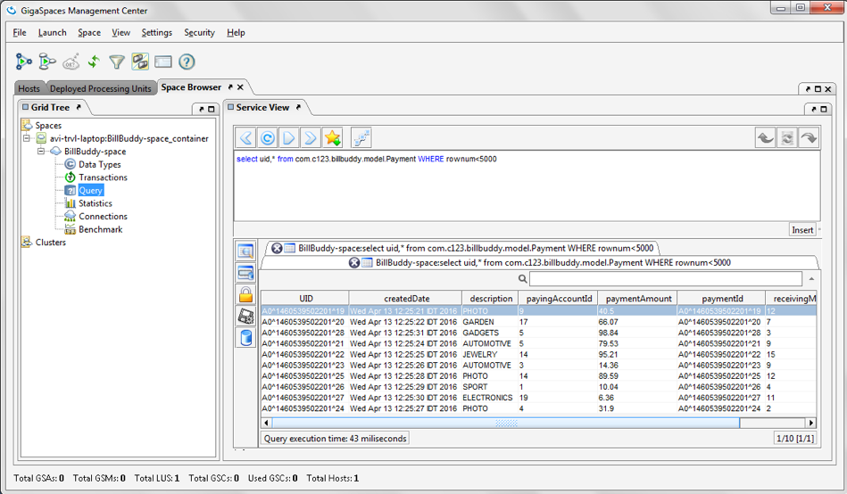

# xap-dev-training - lab11-exercise

## 11	Advance Space Access API

###### Lab Goals
1. Experience using change API
2. Experience bulk operations
3. Understand and test the Lease concept. 
4. Practice WIKI search 

###### Lab Description
This lab includes2 exercises:
1. 	Space Data Access API: Change the PaymentFeeder PU to use change API.
2. 	Only if time permits: Bulk operations: you will modify the writing mechanism to write 5 Payments at a time. 

###### Lab setup
Make sure you restart gs-agent and gs-ui (or at least undeploy all Processing Units using gs-ui)

11.1.1 Create dir: %XAP_TRAINING_HOME%/labs/lab11-exercise

    mkdir /Users/yuval/XAPDevTraining/labs/lab11-exercise

11.1.2 Navigate to lab11-exercise dir

    cd /Users/yuval/XAPDevTraining/labs/lab11-exercise

11.1.3 Clone the git project

    git clone https://github.com/GigaSpaces-ProfessionalServices/xap-dev-training.git

11.1.4 Checkout lab11-exercise

    cd xap-dev-training
    git checkout lab11-exercise
    
11.1.5 Verify that the branch has been checked out.

    yuval-pc:xap-dev-training yuval$ git branch
    * lab11-exercise
      master
               
11.1.6 Open xap-dev-training project with intellij  
11.1.7 Run mvn install

    yuval-pc:xap-dev-training yuval$ mvn install
    
       [INFO] ------------------------------------------------------------------------
       [INFO] Reactor Summary:
       [INFO] 
       [INFO] Lab11-exercise 1.0-SNAPSHOT ........................ SUCCESS [  0.990 s]
       [INFO] BillBuddyModel ..................................... SUCCESS [  6.876 s]
       [INFO] BillBuddy_Space .................................... SUCCESS [  0.835 s]
       [INFO] BillBuddyAccountFeeder ............................. SUCCESS [  0.985 s]
       [INFO] BillBuddyPaymentFeeder ............................. SUCCESS [  0.879 s]
       [INFO] Bill 1.0-SNAPSHOT .................................. SUCCESS [  0.730 s]
       [INFO] ------------------------------------------------------------------------
       [INFO] BUILD SUCCESS

11.1.8 Run mvn xap:intellij
###### This will add the predefined Run Configuration Application to your Intellij IDE.

    yuval-pc:xap-dev-training yuval$ mvn xap:intellij
    
     [INFO] --- xap-maven-plugin:14.0.1:intellij (default-cli) @ Lab11-exercise ---
     [INFO] ------------------------------------------------------------------------
     [INFO] Reactor Summary:
     [INFO] 
     [INFO] Lab11-exercise 1.0-SNAPSHOT ........................ SUCCESS [  2.399 s]
     [INFO] BillBuddyModel ..................................... SKIPPED
     [INFO] BillBuddy_Space .................................... SKIPPED
     [INFO] BillBuddyAccountFeeder ............................. SKIPPED
     [INFO] BillBuddyPaymentFeeder ............................. SKIPPED
     [INFO] Bill 1.0-SNAPSHOT .................................. SKIPPED
     [INFO] ------------------------------------------------------------------------
     [INFO] BUILD SUCCESS
     
## 11.2	Advance Space Access API	
 11.2.1	In this exercise you will change the implementation of the 
        Payment Feeder class to use change API.  
 11.2.2	Open the BillBuddyPaymentFeeder project.
        Payment Feeder creates a random payment every 1 second.
        The exercise focuses on space data access advance api.
        the other Java code is already prepared for you.   
 The overall requirement is to implement methods using Change API:
 
 1.	Update the User balance in the space (withdraw the amount from the balance) 
    using the change API in method updateUserBalance.
 2.	Update the Merchant balance in the space (deposit the amount to the receipts property), 
    using the change API in method updateMerchantReceipts.
 3.	Validate the results  
 a.	Run BillBuddy_Space run the space as Integrated Processing Unit Container using Intellij run configuration.  
 b.	Run BillBuddyAccountFeeder and BillBuddyPaymentFeeder using Intellij run configuration.
 
11.2.3	Validate that Payment Object are written to the space using gs-ui.

## 11.3	Bulk operations (Only if time permits)
11.3.1	Open project BillBuddyMultiplePaymentFeeder and modify LeasePaymentFeeder 
        class to write all 5 Payments in a single writeMultiple command (search for the TODO: ).  
11.3.2	In order to demonstrate objects automatic eviction from the space, 
        make sure payments will stay only 20 seconds in the space (Hint: Lease time)  
11.3.3	Run your new MultiplePaymentFeeder for 30 seconds.   
11.3.4	Using gs-ui examine Payments getting evicted from the space 
        (Hint: Use Data Types operation at gs-ui).

