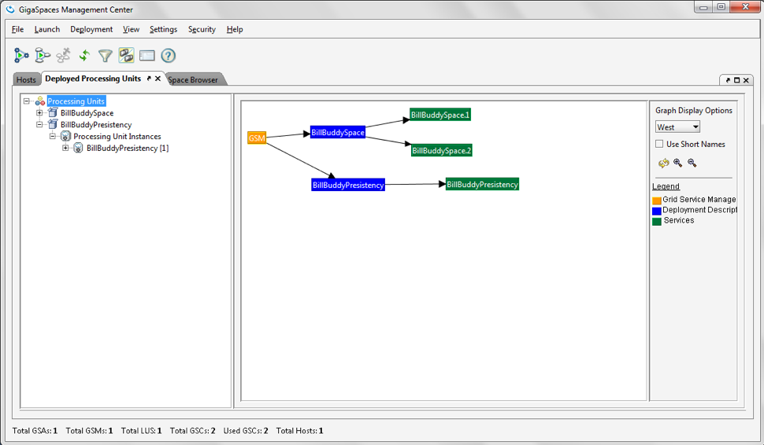
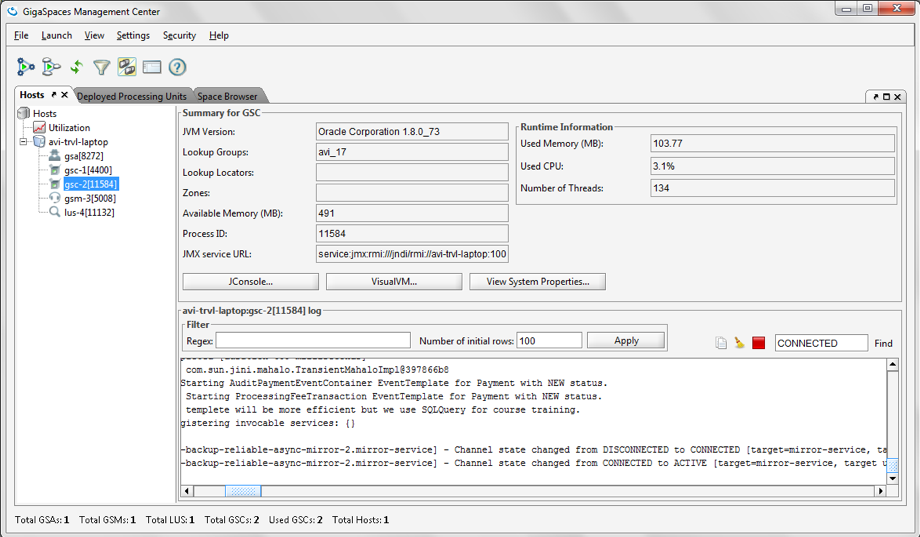
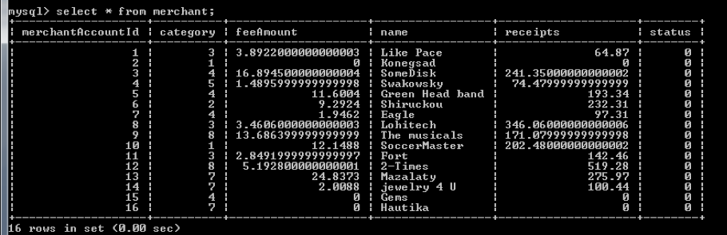
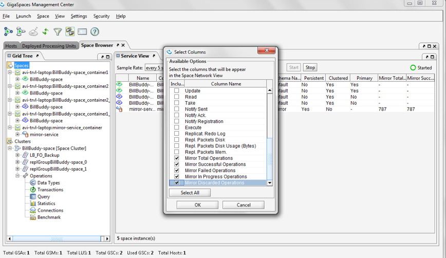

# xap-dev-training - lab17-solution

## 	Persistency – Mirror Service

###### Lab Goals
1.  Understand the tasks involved in implementing a mirror service.
2.  implement a mirror service.
###### Lab Description
This lab includes 1 solution in which we will perform the tasks required to implement a mirror service. 
Use the slides from the lesson as a reference.
## 1 Lab setup
Make sure you restart gs-agent and gs-ui (or at least undeploy all Processing Units using gs-ui)

1.1 Open %XAP_TRAINING_HOME%/xap-dev-training-lab17-solution project with intellij (open pom.xml) 
1.2 Run mvn install

    ~/xap-dev-training/xap-dev-training-lab17-solution$ mvn install
    
    [INFO] ------------------------------------------------------------------------
    [INFO] Reactor Summary:
    [INFO] 
    [INFO] Lab17-solution 1.0-SNAPSHOT ........................ SUCCESS [  0.994 s]
    [INFO] BillBuddyModel ..................................... SUCCESS [  5.310 s]
    [INFO] BillBuddy_Space .................................... SUCCESS [  1.187 s]
    [INFO] BillBuddyAccountFeeder ............................. SUCCESS [  1.401 s]
    [INFO] BillBuddyPaymentFeeder 1.0-SNAPSHOT ................ SUCCESS [  1.293 s]
    [INFO] ------------------------------------------------------------------------
    [INFO] BUILD SUCCESS

1.3 Run mvn xap:intellij
###### This will add the predefined Run Configuration Application to your Intellij IDE.

    ~/xap-dev-training/xap-dev-training-lab17-solution$ mvn xap:intellij
    
    [INFO] --- xap-maven-plugin:14.0.1:intellij (default-cli) @ Lab17-solution ---
    [INFO] ------------------------------------------------------------------------
    [INFO] Reactor Summary:
    [INFO] 
    [INFO] Lab17-solution 1.0-SNAPSHOT ........................ SUCCESS [  2.300 s]
    [INFO] BillBuddyModel ..................................... SKIPPED
    [INFO] BillBuddy_Space .................................... SKIPPED
    [INFO] BillBuddyAccountFeeder ............................. SKIPPED
    [INFO] BillBuddyPaymentFeeder 1.0-SNAPSHOT ................ SKIPPED
    [INFO] ------------------------------------------------------------------------
    [INFO] BUILD SUCCESS
    
## 2	Persistency – Mirror Service Implementation
#### 2.1	Setup MySQL DB (Windows) for this lesson.  
SKIP this step if you are using Linux/Mac  
a.	Go to https://dev.mysql.com/downloads/mysql and download aviable GA MySQL Community Server.  
b.  Extract it to: c:\mysql  
c.	Note: Make sure you shut down any prior existing mysqls in your system.  
d.	Open a command window  
e.	Navigate c:\mysql\bin:   

    cd C:\mysql\mysql-5.5.48-winx64\bin
        
e.	Run the mysql server: 

    mysqld --console
        
f.	Open another command window  
g.	Navigate to the same Bin directory you navigated to at section (e)  
h.	Run the following command to create BillBuddy database:

    mysqladmin.exe --user=root create jbillbuddy

#### 2.2	Setup MySQL DB (Linux) for this lesson.  
**SKIP this step if you are using Windows/Mac**  
a.	Execute “yum install mysql-server”(downloads and install MySql server) or "sudo apt-get install mysql-server"  
b.	Start MySQL service:  

    /sbin/service mysqld start ( or sudo service mysql start)

c.	Open MySQL shell:

    a.	Open terminal 
    b.	Run: /usr/bin/mysqladmin --user=root create jbillbuddy

d.	Validate that your instance has been created: 

    a.	Open terminal 
    b.	Run: /usr/bin/mysql jbillbuddy-u root –p
    c.	No password is required
    d.	Run: show tables;
    e.	Verify no tables exist.

#### 2.3	Setup MySQL DB (Mac) for this lesson.  
**SKIP this step if you are using Windows/Linux**  
a.	downloads and install MySql server ( download DMG file link: http://dev.mysql.com/downloads/file/?id=462024 )  
b.	Install MySQL  
	Download and open the MySQL package installer, 
	which is provided on a disk image (.dmg) that includes the main MySQL installation package file.
	Double-click the disk image to open it.  
c.	Start MySQL service

    a.	Open terminal 
    b.	Run: sudo /usr/local/mysql/support-files/mysql.server start

c.	if you wish to stop or restart run the same command with stop or restart at the end.  
d.	Open MySQL shell:

    a.	Open terminal 
    b.	cd /usr/local/mysql/bin
    c.	Run:  ./mysqladmin --user=root create jbillbuddy
    
e.	Validate that your instance has been created
 
    a.	Open terminal 
    b.	cd /usr/local/mysql/bin
    c.	Run:  ./mysql jbillbuddy -u root
    d.	No password is required
    e.	Run: show tables;
    f.	Verify no tables exist.

#### 2.4	Configure your space to be mirror service aware.  .
a.	Modify your embedded Space Pu.xml. mirrored="true" space element tag (Hint: BillBuddy_space pu.xml)  
#### 2.5	Map the data model to tables (using Hibernate. we will use annotations.)  
a.	Search the data model to see which POJOs were chosen for persistency for our demo  
b.	Examine specifically the User and Address relationship and try to figure out the meaning of the hibernate annotations.  
#### 2.6	Configure the mirror service.  
The mirror service requires having to be configured appropriately. 
The lab is already configured correctly for you. 
Your task is to locate the file in which the configuration is defined.
Basically you should be able to answer the following questions prior to configuring the environment.   
a.	What space am I Mirroring?  
Answer: BillBuddy-space  
b.	Which POJOs am I to persist?  
Answer: In this lab we will persist: User, Merchant, Payment, ProcessingFee and Contract
Package Name: com.gs.billbuddy.model  
c.	What is the database (in most cases) that I am persisting to?   
Answer: we will use MySQL DB for demo purposes.  		
d.	What are the DB user name, DB password, JDBC URL and JDBC Driver?  
Answer: 

#### 2.7	The following tasks will make it clearer how to implement a Mirror service.  
Hint: Use slides from the lesson as a reference. Most tasks are already implemented.  
a.	Expand BillBuddyPersisitency and open the pu.xml file.  
b.	Locate the data source bean (DB Connection properties). 
Write down the user and the password for the MySQL DB database 
(You will use it later).  
c.	Specify Space Components to be mapped using package scanning. 

Configure spring to locate your hibernate annotated classes.  
1.	Fill in the package to be scanned where your persistent 
POJOs are located 
(Search the POJOs in the model that were annotated with @Entity and write their full name in the SessionFactory bean). 
<property name="packagesToScan" value="com.gs.billbuddy.model" />
2.	Hint: 4 classes only for this demo (but all in same package)
d.	Specify the mirror to recognize the mirror space (This step is already implemented)
1.	Complete the os-core:mirror -> os-core:source-space
2.	Use slides from the lesson as a reference.  

#### 2.8	Make sure you have a Database ready for use.
We will using MySQL db instance.  
a.	Make sure you have the MySQL instance up and running (see section 13.1.1 (e) )

#### 2.9	Jar the BillBuddyPersistency project. Make sure to include the BillBuddyModel in the Jar.  
#### 2.10	Deploy and test the Mirror service (and your space).  
 
a.	Run gs-agent  
    `./gs.sh host run-agent --auto --gsc=5`
b.	Run gs-ui  
c.	Deploy BillBuddy_space to the service grid.  
    `./gs.sh pu deploy BillBuddy-Space /Users/aharonmoll/xap-dev-training/xap-dev-training-lab17-solution/BillBuddy_Space/target/BillBuddy_Space.jar`
d.	Deploy BillBuddPersistency to the service grid (Remember to include BillBuddy model Project. See below)  
    `./gs.sh pu deploy BillBuddyPersistency /Users/aharonmoll/xap-dev-training/xap-dev-training-lab17-solution/BillBuddyPersistency/target/BillBuddyPersistency.jar`
e.	Validate Mirror service deployed using gs-ui  

f.	Locate the GSC your mirror service was deployed to using gs-ui and see the GSC log to validate successful deployment.
Search for the following message in both GSCs that contain primary space instances:

    2014-02-07 14:16:14,884 BillBuddy_space.2 [1] INFO [com.gigaspaces.replication.channel.BillBuddy-space2.primary-backup-reliable-async-mirror-2.mirror-service] - Outgoing Replication Channel: moved to state: CONNECTED 

g.	Run BillBuddyAccountFeeder  
h.	Run BillBuddyPaymentFeeder  

#### 2.11	Only for Windows - Open Relational Database Windows  

a.	Open windows command window
b.	Navigate Mysql bin directory: 

    cd C:\mysql\mysql-5.5.48-winx64\bin

c.	Run the following command in order to connect to the BillBuddy database:
 
    mysql -u root -p jbillbuddy
    
When prompt for a password click <enter>  
d.	Use the command in order to view your table list. These tables were created by Hibernate mappings. 
show tables;  
e.	Select the content of any table by issuing the following command:
 
    select * from merchant;
    
f.	Validate the results

#### 2.12	Only for Linux - Open Relational Database  
a.	For Linux - Validate that your instance has been created.  
 
    a.	Open terminal 
    b.	Run: /usr/bin/mysqljbillbuddy -u root –p
    c.	No password is required

b.	Select the content of any table by issuing the following command:
 
    select * from merchant;

#### 2.13	Only for Mac  - Open Relational Database  
a.	For Mac - Validate that your instance has been created:

    a.	Open terminal 
    b.	cd /usr/local/mysql/bin
    c.	Run:  ./mysql jbillbuddy -u root
    d.	No password is required

b.	Select the content of any table by issuing the following command:
 
    select * from merchant;

#### 2.14	Monitoring the Mirror service

#### 2.15	Compare the number of mirror total operations against the overall number of POJOs you have. Count only POJOs you persist. Can you explain why there are many more mirror operations than POJOs?

 

