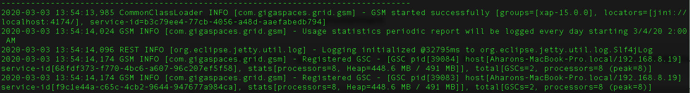
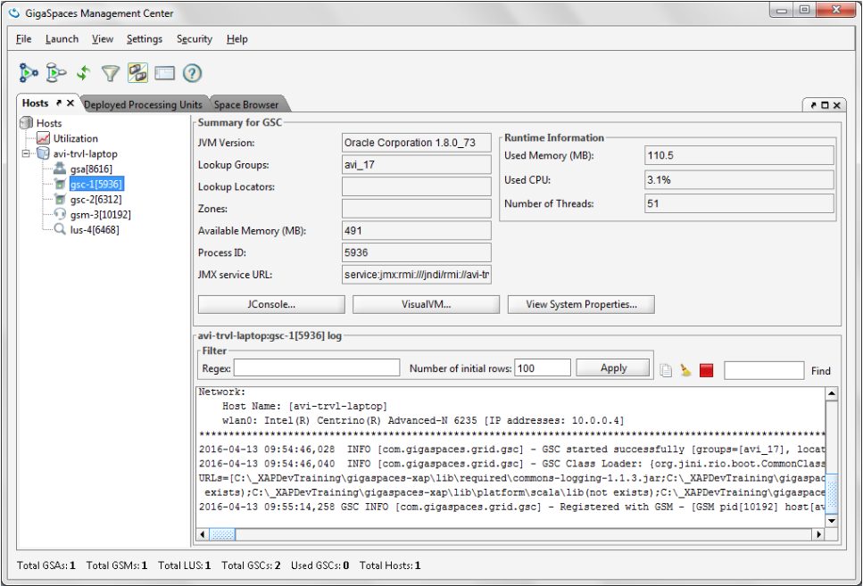
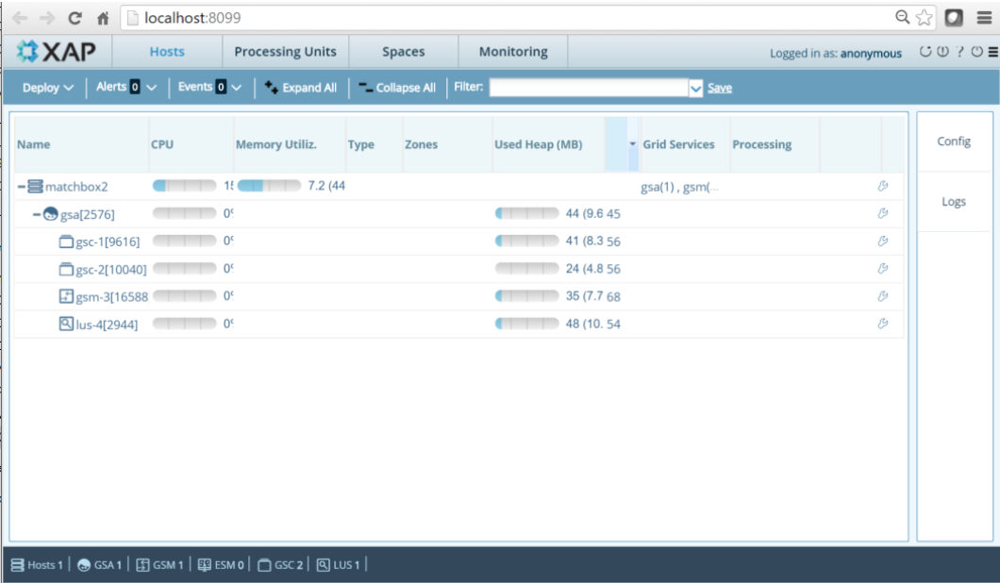

# xap-dev-training - lab2-guide

## 2	XAP Overview

###### Lab Goals
*   Be introduced and experienced Grid Service Components

###### Lab Description
In this lab you will start XAP infrastructure services. Inspect the runtime grid in the GS-UI.

2.1.1	Start XAP Infrastructure

    a.	Goto %XAP_TRAINING_HOME%\gigaspaces-xap\bin
    b.	Start gs-agent
    c.	Start gs-ui
    d.	Start gs-webui (localhost:8099)
    
2.1.2	Examine the running environment
    
    a. Examine the ‘gs-agent.log’ Check the GSM and GSCs have started and registered successfully 

    b.	Go to the gs-ui application
    c.	Press the host tab
    d.	Press on the gsc processes to see the process information and log.
    

    e.	Open your browser and got localhost:8099
    f.	Examine the webui console.
    g.	You will learn more about it at a later session.
    

