# xap-dev-training - lab4-guide

## 4	Application Level Components

###### Lab Goals 
•	Be introduced and experienced Grid Service Components  
•	Deploy, test and Un-deploy Grid Service Components (In-Memory-Data-Grid)  
•	Experience the self-healing capability of the space  

###### Lab Description
In this lab you will start XAP infrastructure services. Deploy a Space, perform some benchmarks using a benchmark tool that will test your space and undeploy the space. You will perform most actions using command line or the “GigaSpace` Management Console" service 
(a.k.a. gs-ui). You will also try to check the self-healing capabilities of the space by stopping a GSC and see how XAP heals itself.

## 4.1	Start XAP Infrastructure

a.	Go to%XAP_TRAINING_HOME%\gigaspaces-xap\bin  
b.	Start gs-agent  
c.	Start gs-ui  
d.	Press on the gsc processes to see the process information and log.  

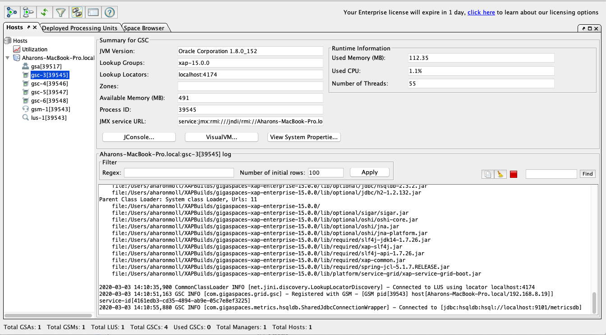

## 4.2	Deploy an In Memory Data Grid
a.	Use the “Deploy an In Memory Data Grid” option in the menu (see top left red arrow in the diagram below)  
*   the 'deploy data grid' is also available from the menu -> launch  
 
b.	A Deployment Wizard screen will open

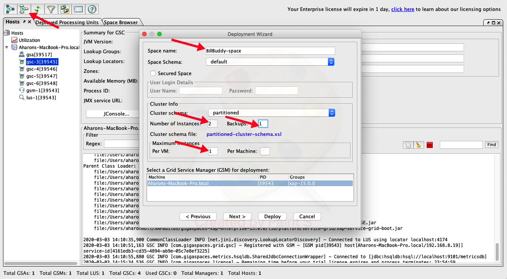

c.	Fill in the fields as follows (see red arrows for locations)

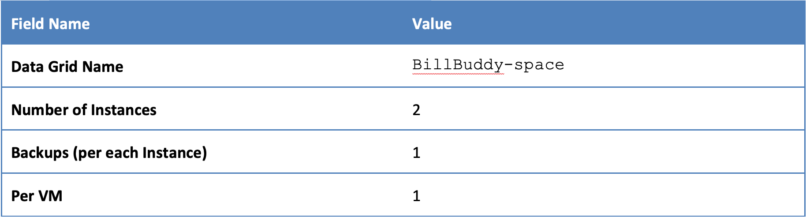

d.	Press the Deploy button. The following should be the status of the deployment wizard after all deployments are done:

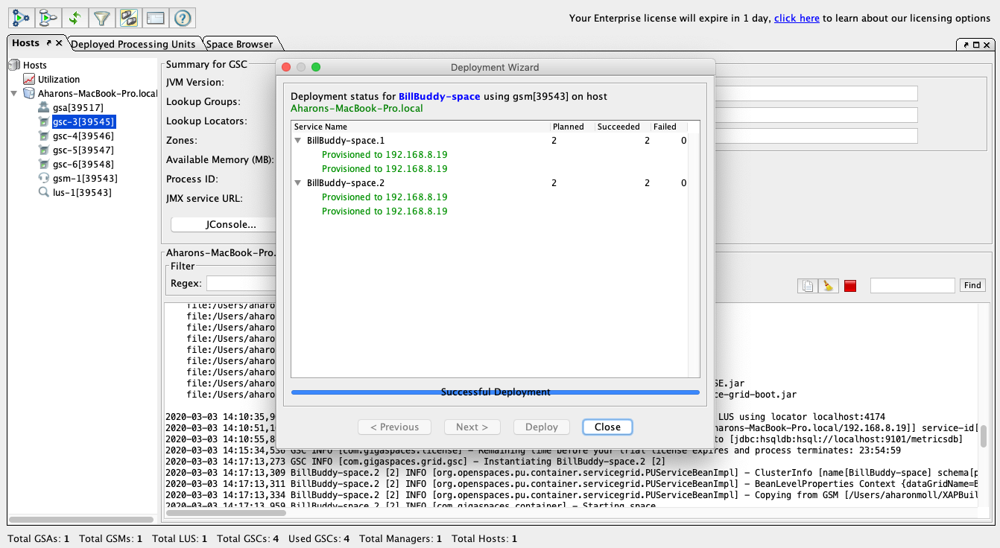

e.	Press the close button

f.	Examine the space “Deployed Processing Unit” tab

*   Identify the primary and backup partitions

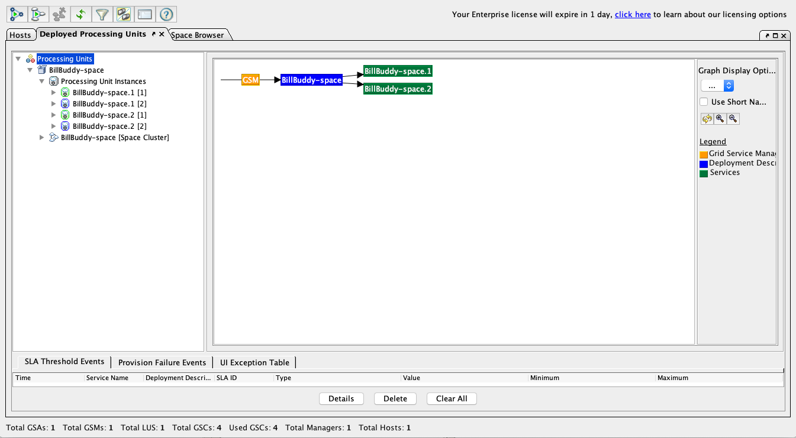

g.	Examine the “Space Browser” tab

Hint: use the table in the Service View Tab.

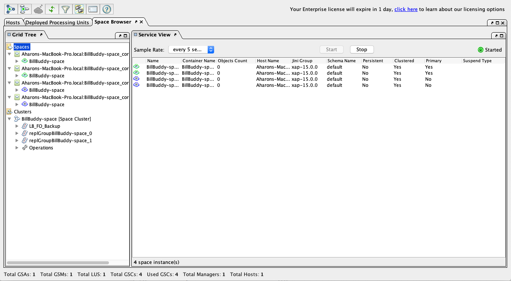

h.	Examine which space instance is located on which GSC?

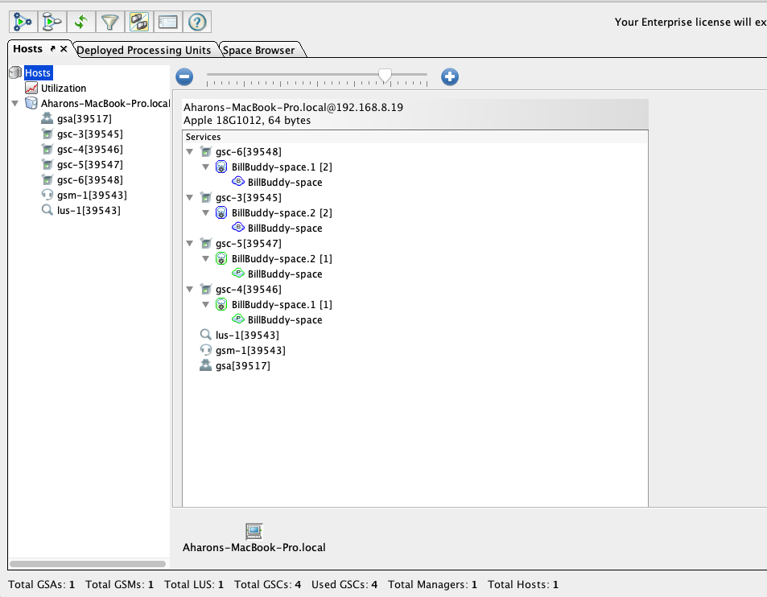

## 4.3	Test your In Memory Data Grid
At this exercise we will examine several operations that allow you to test, monitor and examine objects that are stored in the space. The tools that we will use are: Benchmark, Statistics and Query, located in the circle at the snapshot below.  

4.3.1	Press on the Benchmark tool

The benchmark tool allows you to perform operations against the space. You can monitor the space performance using the statistics operation.

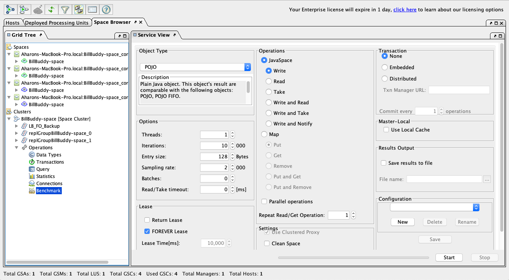

4.3.2	Perform a write and read 10,000 POJOs 
(Simply press start but examine the tool input data prior to activating it)  

4.3.3	While the benchmark is executing go to the statistics operation and check the statistics  

4.3.4	Perform more benchmarks and view the result in the statistics page. For example perform a read. Your statistics view might look something like this:

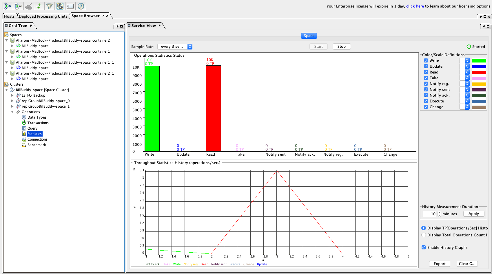

4.3.5	Go to the Query operation and press on the execute button (red arrow)
What you see is the list of Space Object types (Classes) that are currently stored in the space

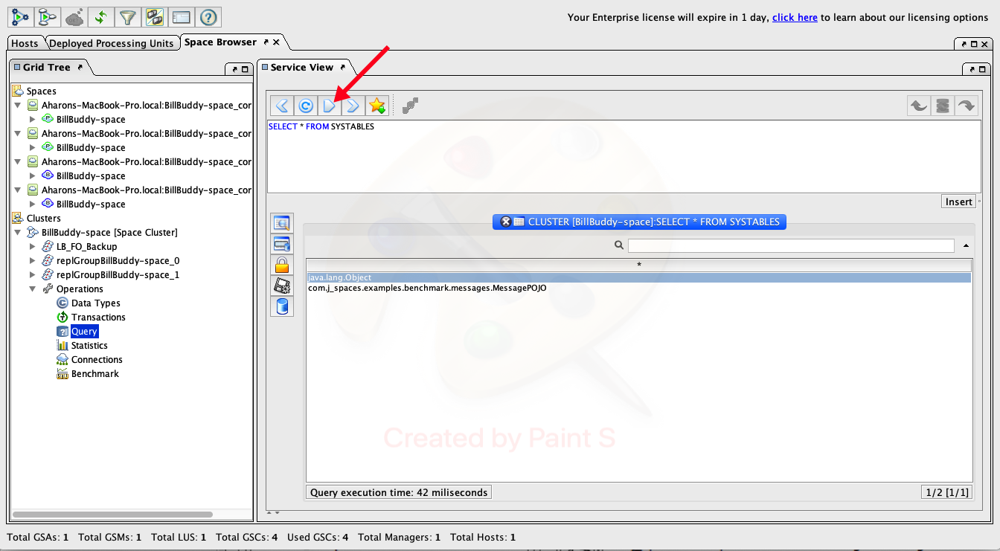

In later lessons we will use this view to query the objects

Go to the Data_Types operation select the MessagePOJO data type and press query.

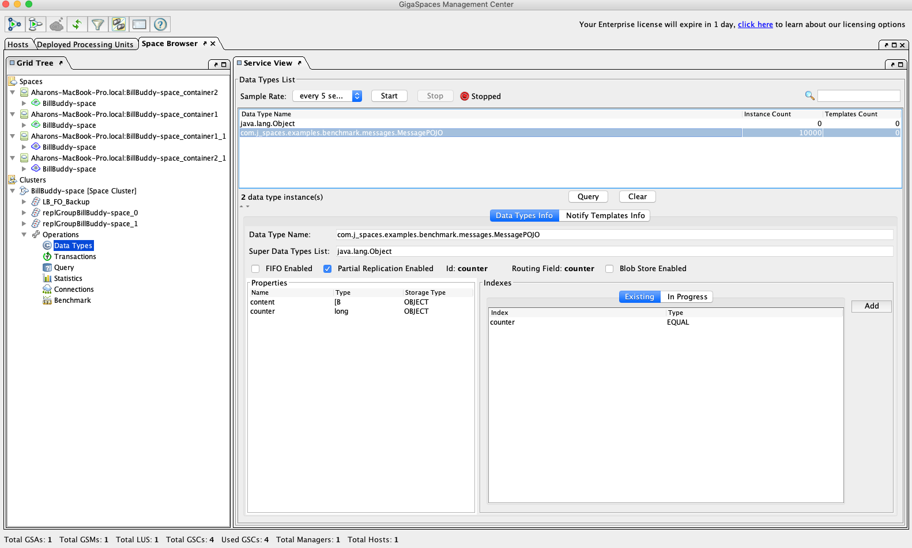

4.3.7	Examine the objects written to space.

## 4.4	Self-Healing

In this exercise you will be introduced to the self-healing capabilities of the In Memory Data Grid.
Basically we will ‘kill’ (using task manager or kill -9) a GSC process and see that it restarts automatically by the gs-agent and that new partition are created accordingly  

4.4.1	Each process ID (all are JVMS) is shown at the Hosts tab (see red circle). Choose 1 of the GSCs PID and use the Task Manager or (kill -9 for Linux) in order to kill the process.  
 
If PID is not shown at the Task Manager simply choose “viewselect columns” and add the PID column.

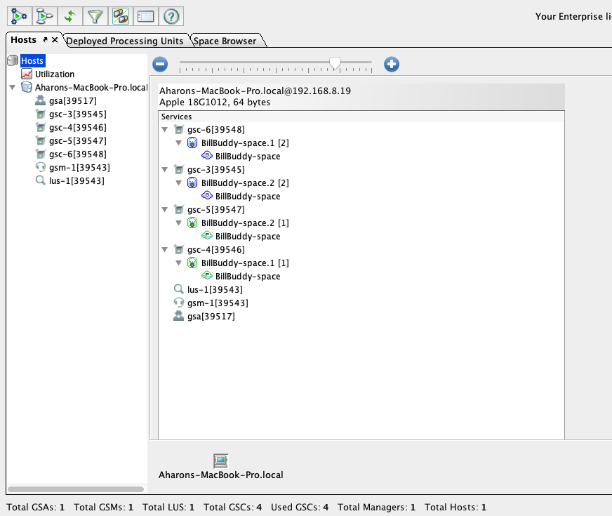

4.4.2	Return to the gs-ui in order to check the recovery status.

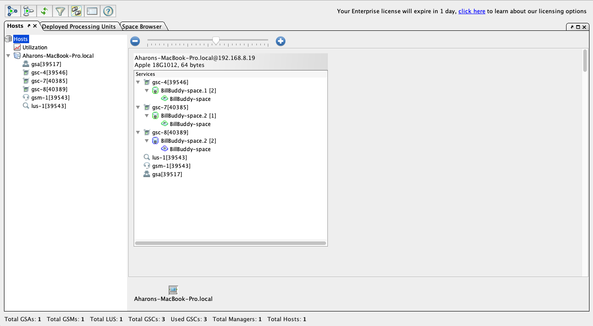

4.4.3	The following is the Self Healing processes

    a.	A backup turned to Primary
    b.	GSC was re-launched by gs-agent
    c.	New backup partitions were provisioned

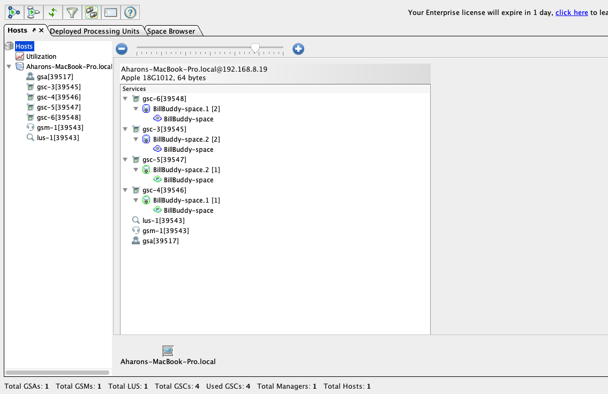

4.4.4	Recovery is performed but both primary partitions are located in the same GSC. Is that problematic? The backup partition is now a primary.

4.4.5	Restart a primary partition by selecting the primary partition (red arrow) and right click Restart BillBudy-space.1 [2]. What happens?

4.4.6	Why is it important to have each primary on a different GSC?

## 4.5	Un-deploy a Data Grid

4.5.1	Click on Deployed Processing Units tab

4.5.2	Right click on space and click on “Undeploy”

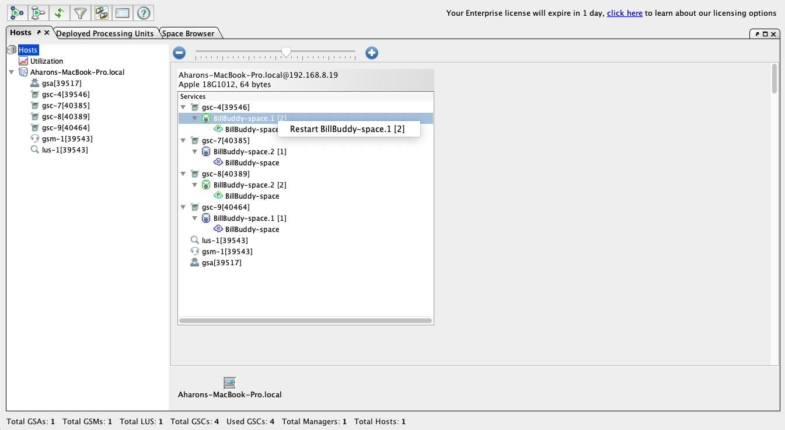

4.5.3	The following screen should appear:

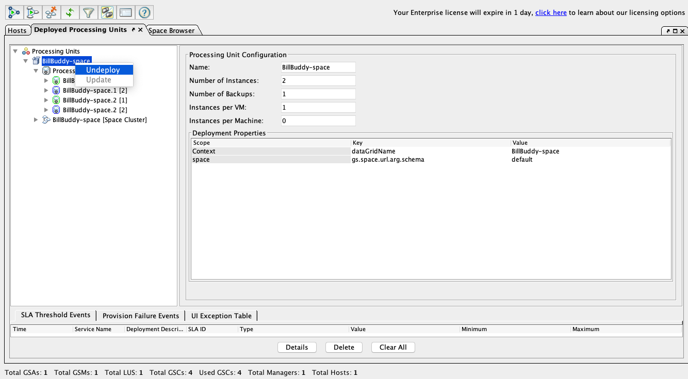

4.5.4	You have Un-deployed the space successfully

