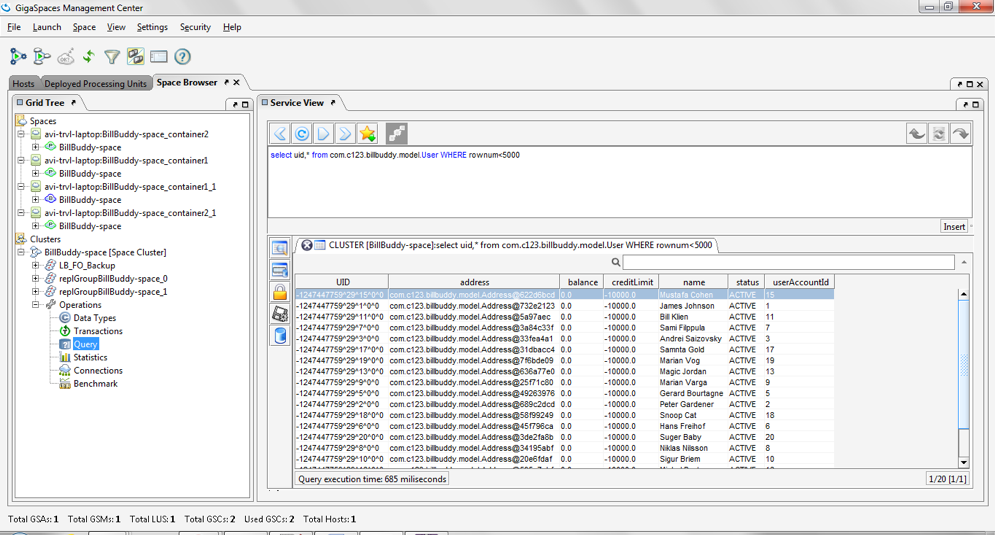

# xap-dev-training - lab5-solution

## Lab Goals

1. Experience an application deployment process.  
2. Get familiar with the BillBuddy application  

## Lab Description
In this lab we will focus on deployment and the application and not be concerned with code, therefore simply focus on the deployment process, you will use this process throughout the labs here on.

## 1	Start the service grid and gs-ui 

1.1 Navigate to %XAP_HOME/bin  
        
1.2 Start the service grid with local Manager server and 6 GSCs:

    ./gs.sh host run-agent --auto --gsc=6
    
1.3 Start gs-ui.

    ./gs-ui.sh
    
## 2	Deploy BillBuddy_Space
    
2.1 Open %XAP_TRAINING_HOME%/xap-dev-training-lab5-solution project with intellij (open pom.xml)  
2.2 Run mvn install  

    ~/xap-dev-training/xap-dev-training-lab5-solution$ mvn install
    
    
    [INFO] ------------------------------------------------------------------------
    [INFO] Reactor Summary:
    [INFO] 
    [INFO] Lab5-solution 1.0-SNAPSHOT ......................... SUCCESS [  0.935 s]
    [INFO] BillBuddyModel ..................................... SUCCESS [  6.586 s]
    [INFO] BillBuddy_Space .................................... SUCCESS [  1.192 s]
    [INFO] BillBuddyAccountFeeder ............................. SUCCESS [  0.737 s]
    [INFO] BillBuddyCurrentProfitDistributedExecutor .......... SUCCESS [  1.393 s]
    [INFO] BillBuddyWebApplication 14.0.1 ..................... SUCCESS [  3.370 s]
    [INFO] BillBuddyPaymentFeeder 1.0-SNAPSHOT ................ SUCCESS [  0.466 s]
    [INFO] ------------------------------------------------------------------------
    [INFO] BUILD SUCCESS

2.3 IntelliJ path Variables

###### Add GS_LOOKUP_GROUPS & GS_LOOKUP_LOCATORS

2.4 Copy the runConfigurations directory to the Intellij .idea directory to enable the Java Application configurations. Restart Intellij.

###### This will add the predefined Run Configuration Application to your Intellij IDE.

    ~/xap-dev-training/xap-dev-training-lab5-solution$ mvn xap:intellij
    
    [INFO] Lab5-solution 1.0-SNAPSHOT ......................... SUCCESS [  0.757 s]
    [INFO] BillBuddyModel ..................................... SKIPPED
    [INFO] BillBuddy_Space .................................... SKIPPED
    [INFO] BillBuddyAccountFeeder ............................. SKIPPED
    [INFO] BillBuddyCurrentProfitDistributedExecutor .......... SKIPPED
    [INFO] BillBuddyWebApplication 14.0.1 ..................... SKIPPED
    [INFO] BillBuddyPaymentFeeder 1.0-SNAPSHOT ................ SKIPPED
    [INFO] ------------------------------------------------------------------------
    [INFO] BUILD SUCCESS

2.5 Open a new Terminal and navigate to %XAP_TRAINING_HOME%/gigaspaces-xap/bin/  

    cd %XAP_HOME/bin
           
2.6 Use XAP CLI to deploy BillBuddy_Space
 
    ./gs.sh pu deploy BillBuddy-Space ~/xap-dev-training/xap-dev-training-lab5-solution/BillBuddy_Space/target/BillBuddy_Space.jar 

## 3	Run BillBuddyAccountFeeder from Intellij

3.1 From the Intellij run configuration select BillBuddyAccountFeeder and run it. 
3.2 Another option is to run it from the maven command line: 
    `cd ~/xap-dev-training/xap-dev-training-lab5-solution/BillBuddyAccountFeeder` 
    `mvn exec:java  -D"exec.mainClass"="com.gs.billbuddy.client.AccountFeeder" -Dexec.classpathScope=compile -Dcom.gs.jini_lus.locators=localhost` 

###### This application writes Users and Merchants to the Space
 
3.2 Validate Users and Merchants were written to the space using gs-ui.  
 Go to: Space Browser Tab -> Clusters -> Operations -> Data Types.  
 Examine the list of classes from which objects were written to the space.
 

3.3 Query the list of Users by executing the following SQL:  
Choose the query option and copy the following SQL command to the SQL area:  

    SELECT * FROM com.gs.billbuddy.model.User
    
###### Note: Fully qualified class name is required. (You can use copy paste in the gs-ui)

## 4	Run BillBuddyPaymentFeeder project
The BillBuddyPaymentFeeder application creates payments by randomly choosing a user, 
a merchant and an amount and performs the initial process of a payment. 
This includes deposit and withdrawal updates of each party’s balance appropriately. 
After the payment is initially processed it is written to the space for further processing. 
You will be further introduced with this application in a later lesson in greater detail. 
A new Payment is created every second.
 
4.1 Run the BillBuddyPaymentFeeder using Intellij: 
1.   Use the same instructions as used for the BillBuddyAccountFeeder.
2.   Another option is to run/deploy it from the GS command line: 
    `cd %XAP_HOME/bin` 
    `./gs.sh pu deploy BillBuddyPaymentFeeder ~/xap-dev-training/xap-dev-training-lab5-solution/BillBuddyPaymentFeeder/target/BillBuddyPaymentFeeder.jar` 

4.2 Validate Payments were written to the space using gs-ui. 
You may choose to view Payment Objects using the Query operation of gs-ui.
 
4.3 Go to the statistics operation and see that a payment is actually added every second.
You might be required to modify the sample rate and start the automatic refresh.

4.4 Go to the Data Types view under Operations. Which object counts are increasing?

## 5 Deploy BillBuddyWebApplication project

5.1 Open a new Terminal and navigate to %XAP_TRAINING_HOME%/gigaspaces-xap/bin/

5.2 Use XAP CLI to deploy BillBuddyWebApplication
 
    ./gs.sh pu deploy --property=web.port=8082 BillBuddyWebApplication ~/xap-dev-training/xap-dev-training-lab5-solution/BillBuddyWebApplication/target/BillBuddyWebApplication.war

5.3 Validate the application is deployed. 
Go to Deployed Processing Units tab and expand the BillBuddyWebApplication PU.

5.4 The URL is for the application home page URL. 
Click on it and get to the application. 

5.5 Congratulations, you have deployed the BillBuddy web application. 
Navigate through the application pages and investigate it.
