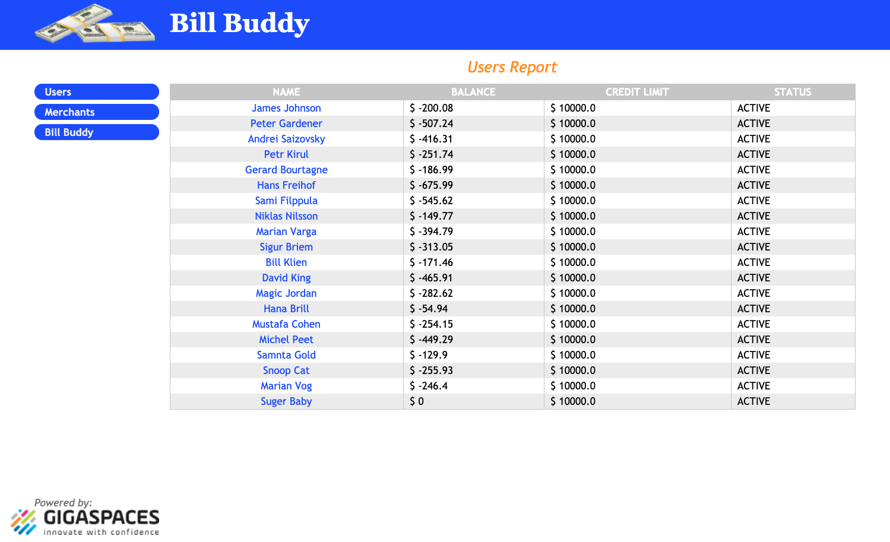

# xap-dev-training - lab5-solution

## 5.1	Start gs-agent and gs-ui 

5.1.1 Navigate to %XAP_HOME/bin  
        
5.1.2 Start gs-agent with one GSM, one LUS and 2 GSCs.

    ./gs.sh host run-agent --auto --gsc=5
    
5.1.5 Start gs-ui.

    ./gs-ui.sh
    
## 5.2	Deploy BillBuddy_Space

5.2.1 Go to %XAP_TRAINING_HOME%/xap-dev-training-lab5-solution
    
5.2.2 Open xap-dev-training-lab5-solution project with intellij (open pom.xml)  
5.2.3 Run mvn install  

    Aharons-MBP:xap-dev-training aharonmoll$ mvn install
    
    
    [INFO] ------------------------------------------------------------------------
    [INFO] Reactor Summary:
    [INFO] 
    [INFO] Lab5-solution 1.0-SNAPSHOT ......................... SUCCESS [  0.935 s]
    [INFO] BillBuddyModel ..................................... SUCCESS [  6.586 s]
    [INFO] BillBuddy_Space .................................... SUCCESS [  1.192 s]
    [INFO] BillBuddyAccountFeeder ............................. SUCCESS [  0.737 s]
    [INFO] BillBuddyCurrentProfitDistributedExecutor .......... SUCCESS [  1.393 s]
    [INFO] BillBuddyWebApplication 14.0.1 ..................... SUCCESS [  3.370 s]
    [INFO] BillBuddyPaymentFeeder 1.0-SNAPSHOT ................ SUCCESS [  0.466 s]
    [INFO] ------------------------------------------------------------------------
    [INFO] BUILD SUCCESS

5.2.4 IntelliJ path Variables

###### Add GS_LOOKUP_GROUPS & GS_LOOKUP_LOCATORS

5.2.5 Run mvn xap:intellij

###### This will add the predefined Run Configuration Application to your Intellij IDE.

    Aharons-MBP:xap-dev-training aharonmoll$ mvn xap:intellij
    
    [INFO] Lab5-solution 1.0-SNAPSHOT ......................... SUCCESS [  0.757 s]
    [INFO] BillBuddyModel ..................................... SKIPPED
    [INFO] BillBuddy_Space .................................... SKIPPED
    [INFO] BillBuddyAccountFeeder ............................. SKIPPED
    [INFO] BillBuddyCurrentProfitDistributedExecutor .......... SKIPPED
    [INFO] BillBuddyWebApplication 14.0.1 ..................... SKIPPED
    [INFO] BillBuddyPaymentFeeder 1.0-SNAPSHOT ................ SKIPPED
    [INFO] ------------------------------------------------------------------------
    [INFO] BUILD SUCCESS

5.2.6 Open a new Terminal and navigate to %XAP_TRAINING_HOME%/gigaspaces-xap/bin/  
5.2.7 Use XAP CLI to deploy BillBuddy_Space
 
    ./gs.sh pu deploy BillBuddy-Space /Users/aharonmoll/xap-dev-training/xap-dev-training-lab5-solution/BillBuddy_Space/target/BillBuddy_Space.jar 

## 5.3	Run BillBuddyAccountFeeder from Intellij

5.3.1 From the Intellij run configuration select BillBuddyAccountFeeder and run it.

###### This application writes Users and Merchants to the Space
 
5.3.2 Validate Users and Merchants were written to the space using gs-ui.  
 Go to: Space Browser Tab -> Clusters -> Operations -> Data Types.  
 Examine the list of classes from which objects were written to the space.
 

5.3.3 Query the list of Users by executing the following SQL:  
Choose the query option and copy the following SQL command to the SQL area:  

    SELECT * FROM com.c123.billbuddy.model.User
    
###### Note: Fully qualified class name is required. (You can use copy paste in the gs-ui)

## 5.4	Run BillBuddyPaymentFeeder project
The BillBuddyPaymentFeeder application creates payments by randomly choosing a user, 
a merchant and an amount and performs the initial process of a payment. 
This includes deposit and withdrawal updates of each party’s balance appropriately. 
After the payment is initially processed it is written to the space for further processing. 
You will be further introduced with this application in a later lesson in greater detail. 
A new Payment is created every second.
 
5.4.1 Run the BillBuddyPaymentFeeder using Eclipse: 
Use the same instructions as used for the BillBuddyAcountFeeder.

5.4.2 Validate Payments were written to the space using gs-ui. 
You may choose to view Payment Objects using the Query operation of gs-ui.
 
5.4.3 Go to the statistics operation and see that a payment is actually added every second.
You might be required to modify the sample rate and start the automatic refresh.

5.4.4 Go to the Data Types view under Operations. Which object counts are increasing?

## 5.5 Deploy BillBuddyWebApplication project

5.5.1 Open a new Terminal and navigate to %XAP_TRAINING_HOME%/gigaspaces-xap/bin/

5.5.2 Use XAP CLI to deploy BillBuddyWebApplication
 
    ./gs.sh pu deploy BillBuddyWebApplication /Users/aharonmoll/xap-dev-training/xap-dev-training-lab5-solution/BillBuddyWebApplication/target/BillBuddyWebApplication.war

5.5.3 Validate the application is deployed. 
Go to Deployed Processing Units tab and expand the BillBuddyWebApplication PU.

5.5.4 The URL is for the application home page URL. 
Click on it and get to the application. 

5.5.5 Congratulations, you have deployed the BillBuddy web application. 
Navigate through the application pages and investigate it.
