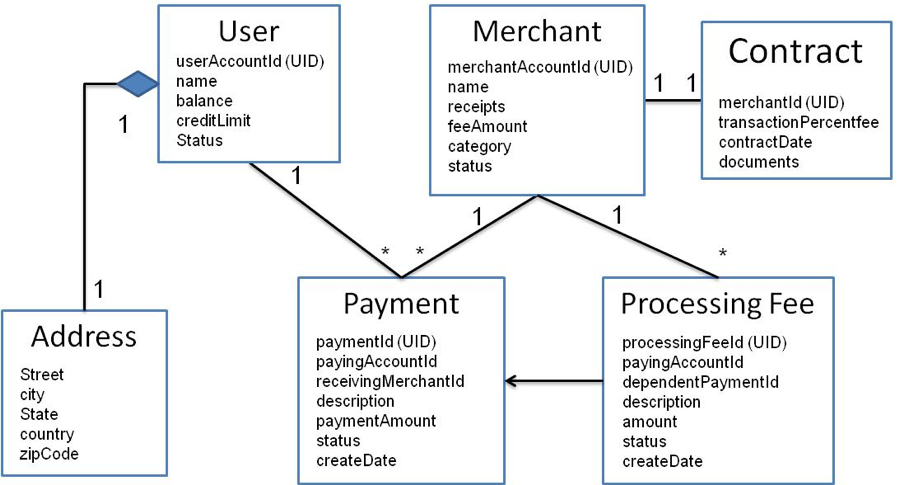
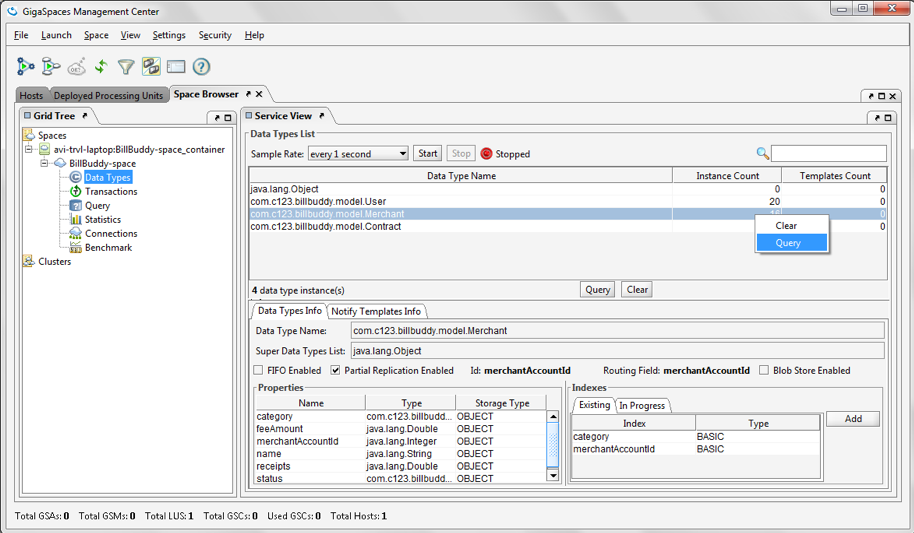
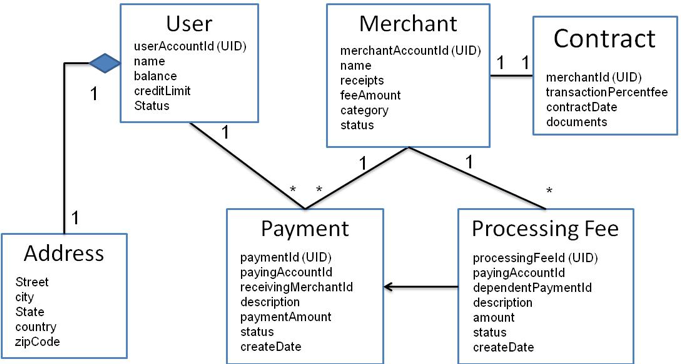

# xap-dev-training - lab8-solution

## Space Classes and Data Model

###### Lab Goals
1. Create POJOs (Space Components) that can be written to the space using annotations
2. Experience complex POJOs by adding embedded Objects
3. Experience the process of data modeling when data partitioning is required

###### Lab Description
This lab includes4 solutions:
1. 	Creating a Data Model: Space Classes by adding annotations to already existing POJOs
2. 	Developing a Merchant Feeder application that will write Merchants to the Space
3.  Embedded Objects exercise in which you will add an “address” property of class Address to User. You will check how these users are being written to the space via gs_ui “query” operation.
4.	Data partitioning consideration exercise in which you will have to determine how it is best to partition your data model given several requirements (Your trainer will lead a discussion about this exercise)

## 1 Lab setup
Make sure you restart the service grid and gs-ui (or at least undeploy all Processing Units using gs-ui)
               
1.1 Open %XAP_TRAINING_HOME%/xap-dev-training-lab8-solution project with intellij (open pom.xml)  
1.2 Run mvn install

    ~/xap-dev-training/xap-dev-training-lab8-solution$ mvn install
    
    [INFO] ------------------------------------------------------------------------
    [INFO] Reactor Summary:
    [INFO] 
    [INFO] Lab8-solution 1.0-SNAPSHOT ......................... SUCCESS [  1.128 s]
    [INFO] BillBuddyModel ..................................... SUCCESS [  3.225 s]
    [INFO] BillBuddy_Space .................................... SUCCESS [  0.607 s]
    [INFO] BillBuddyAccountFeeder 1.0-SNAPSHOT ................ SUCCESS [  0.497 s]
    [INFO] ------------------------------------------------------------------------
    [INFO] BUILD SUCCESS

1.3 Copy the runConfigurations directory to the Intellij .idea directory to enable the Java Application configurations. Restart Intellij.
###### This will add the predefined Run Configuration Application to your Intellij IDE.

    ~/xap-dev-training/xap-dev-training-lab8-solution$ mvn xap:intellij
    
    [INFO] ------------------------------------------------------------------------
    [INFO] Reactor Summary:
    [INFO] 
    [INFO] Lab8-solution 1.0-SNAPSHOT ......................... SUCCESS [  1.925 s]
    [INFO] BillBuddyModel ..................................... SKIPPED
    [INFO] BillBuddy_Space .................................... SKIPPED
    [INFO] BillBuddyAccountFeeder 1.0-SNAPSHOT ................ SKIPPED
    [INFO] ------------------------------------------------------------------------
    [INFO] BUILD SUCCESS
    
## 2	Creating a Data Model
The data model is a set of all classes that should be deployed on both server and client side.  
Therefore it is a separate project that contains Space Classes definitions   
and may also contain Interfaces that serve as contracts for remoting services  
(covered in Space Based Remoting lesson).  
2.1	Examine the BillBuddyModel project and see available POJOs and ENUMs
        that are a part of the model.   
2.2	Compare the classes to the Data Model Diagram 
        (Some POJOs are still missing from the project) 
        

2.3	Expand the BillBuddyModel project and explore the 7 classes in it.  
###### a.	public class Merchant
A Merchant Space Class skeleton that you should complete (see details later in this lab)  
###### b.	public class User 
A User Space Class skeleton that you should complete (see details later in this lab)
###### c.	public class Contract
A Contract Space Class that represents the agreement between BillBuddy and the Merchant (This class is fully annotated and can be used as a reference implementation)
###### d.	public enum AccountStatus
the value for both Merchant and User account Status property.
###### e.	Public  enum CategoryType
An enumeration for Merchant Categories (Sports, Automotives, Cloths…). 
Used for the value of Merchant category property.
###### f.	public class Address
This is not a Space Class. It is used in this lab as an embedded object of User
###### g.	public enum CountryName
An enumeration for the use in Address class. 

2.4	Add Annotations to make the User POJO a Space class according to the following requirements  
a.	The userAccountId property serves as the Unique Identifier for the user 
    and the userAccountId must be provided prior to writing the User object to the space.  
b.	Users will be routed based on their userAccountId.  
c.	Users will be searched by their name   
d.	There will be many range checks on the "creditLimit" to make it more real-life  
e.	The association between User and Address classes is missing. 
    Add to the User class an embedded Address property.  
f.	Implement all other TODO requirements in user.java  
2.5	Add Annotations to make the Merchant POJO a Space class 
    according to the following requirements  
a.	The merchantAccountId property serves as the Unique Identifier 
    for the merchant and the merchantAccountId must 
    be provided prior to writing the Merchant object to the space.  
b.	The merchantAccountId property is also the routing property. 
c.	merchant will be searched by their category.   
    There is no code to run in the above exercise. 
    You will test in the below exercises.  
## 3	Change UserFeeder Application in BillBuddyAccountFeeder.  
    Expand the BillBuddyAccountFeeder project.
    We will use this project to start a java main application that will serve as a feeder. 
    The UserFeeder class is already provided for you (Was demonstrated during the lesson) 
###### Requires changes to be done:
3.1	Open AccountFeeder and follow the //TODO comments.  
        You will be requested to create space proxy in order to get a connection to the space.   
3.2	Open the UserFeeder.java class (BillBuddyAccountFeeder project) and add an address to each User  
a.	Modify UserFeeder to write address for User Objects.  
    You might want to use a Random country by using the following command (not a must):  
###### CountryNames.values()[new Random().nextInt(CountryNames.values().length)]
b.	Fix all imports issues   
c.	Implement a toString() method in the Address class.   
    This will be useful when querying Users via the gs-ui.  
d.	Hint: class Address should implement something… why?  
3.3	Make sure you do not have the service grid running.   
        You are using only gs-ui and Intellij in this Lab 
        which is the way developers should work while developing functionality.   
3.4	Run the BillBuddy-space project using the IntegratedProcessingUnitContainer  
        (See run configurations).  
3.5	Run AccountFeeder  
3.6	Check, using gs-ui “query” operation, 
        how User objects and the address embedded property are written to the space.

## 4	Develop the MerchantFeeder Application

    Expand the BillBuddyAccountFeeder project. 
    We will use this project to start a java main application that will serve as a feeder. 
    The UserFeeder class is already provided for you 
    (Was demonstrated during the lesson & changed in pervious section) 
    and you are now required to complete the Merchant feeder.

4.1	Create space proxy in the AccountFeeder in main method.   
a.	Create the space proxy using configurator. – Look for the TODO remark for the place to implement it.  
4.2	merchantAccountId will serve as the Unique Identifier value 
        and starts with the value 1 (already implemented).  
4.3	The following Merchant properties should be as follows:  
a.	merchantAccountId= incremental value starting with 1.  
b.	name= the Merchant name from the merchants  
    (see merchants ArrayList<string>get merchant method).  
c.	receipts = 0d holds amount for all payments paid to merchant.  
d.	feeAmount = 0d holds amount for all processing fees the merchants pays to BillBuddy.  
e.	category = A random category. 
    hint: to choose a random category use the following command:
        
      categoryTypes[(int) ((categoryTypes.length - 1) * Math.random())]
        
f.	status = AccountStatus.ACTIVE  
4.4	Implement the Merchant Contract creation  
a.	Implement the createMerchantContract()method  
b.	Fill in currentDate, merchantId.  
c.	The RandomTransactionFee is already implemented.  
4.5	Complete the MerchantFeeder according to the instructions
    in the //TODO: comments in the MerchantFeeder.java body.  
a.	Make sure you set the merchantAccountId property with a proper value  
    (Hint: search for an increment variable named merchantAccountId 
    in the MerchantFeeder class.   
b.	Run BillBuddy_Space as Integrated Processing Unit Container 
    using intellij run configuration.  
c.	Run BillBuddyAccountFeeder.  
d.	Validate that Users, Merchant and Contract are being written into the space 
    with the proper data.
e.	Check Users and Merchants are deployed to the space using gs-ui.   
    Here is another way to query all items of a specific POJO:
    
    Go to gs-ui “Data Type” operation and right click. Choose Query and see what happens. 

## 5	Data Partitioning
5.1	How will you partition the BillBuddy data model? Consider the following:  
a.	There are more users than merchants (Ratio of 1:1000)  
b.	BillBuddy is represented by the space (There is no specific space class representing the BillBuddy entity).

5.2	Consider to improve your partitioning model according to the following requirements  
a.	How will you partition your data model considering these Additional Requirements?  
b.	The system provides reports as follows  
* –	Activity reports (List of payments) for merchants & users
* –	BillBuddy performance reports:
    * •	Top 5 Merchants (with biggest sum of processing fees).
    * •	Top 10 Payments.
    * •	BillBuddy Current Profit (total sum of Processing Fees).
* –	Supported merchant reports:
    * •	Search for merchants in a specific category (for example “Clothing”).
    * •	Platinum Merchant list report (Most valuable Merchant for BillBuddy).
    
c.	Reports latency is crucial 
